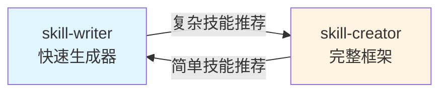

# 技能整合总结

## 📋 完成的工作

### 1. 翻译文件（新增）

| 原文件 | 中文翻译 | 说明 |
|--------|---------|------|
| `skill-creator/SKILL.md` | `skill-creator/SKILL.zh.md` | 完整的技能创建指南（中文版） |
| `skill-creator/references/output-patterns.md` | `skill-creator/references/output-patterns.zh.md` | 输出模式参考 |
| `skill-creator/references/workflows.md` | `skill-creator/references/workflows.zh.md` | 工作流模式参考 |

### 2. 技能整合（更新）

#### skill-writer（轻量级快速生成器）
- ✅ 更新 `description` 明确定位为"快速生成简单技能"
- ✅ 添加"何时使用 skill-creator"章节
- ✅ 建立与 skill-creator 的引用关系

#### skill-creator（完整框架）
- ✅ 英文版添加 skill-writer 快速替代方案说明
- ✅ 中文版添加 skill-writer 快速替代方案说明
- ✅ 明确自身定位为"复杂技能创建框架"

---

## 🎯 技能选择指南

### 使用 skill-writer（快速入口）

**适合场景：**
- 创建纯指令型技能
- 不需要脚本、参考文档或资产文件
- 快速将提示词转换为技能
- 简单的工作流自动化

**示例：**
- commit-message 生成器
- 代码审查检查清单
- 简单的格式转换指令

**调用方式：**
```
用户：创建一个生成 PR 描述的技能
```

### 使用 skill-creator（完整框架）

**适合场景：**
- 需要捆绑 Python/Bash 脚本
- 需要参考文档（数据库架构、API文档等）
- 需要资产文件（模板、样板代码等）
- 需要打包和分发技能

**示例：**
- PDF 处理工具（含旋转脚本）
- BigQuery 数据查询（含表架构文档）
- 前端项目生成器（含样板模板）

**调用方式：**
```
用户：创建一个 PDF 编辑技能，需要包含旋转和合并脚本
```

---

## 📂 目录结构

```
.claude/skills/
├── skill-creator/              # 完整的技能创建框架
│   ├── SKILL.md                # 英文版主文档
│   ├── SKILL.zh.md             # 中文版主文档 ✨新增
│   ├── LICENSE.txt
│   ├── scripts/                # 工具脚本
│   │   ├── init_skill.py       # 初始化技能目录
│   │   ├── package_skill.py    # 打包和验证
│   │   └── quick_validate.py   # 快速验证
│   └── references/             # 参考文档
│       ├── output-patterns.md
│       ├── output-patterns.zh.md  ✨新增
│       ├── workflows.md
│       └── workflows.zh.md        ✨新增
│
└── skill-writer/               # 轻量级快速生成器
    └── SKILL.md                # 中文版（已更新）
```

---

## 🔄 双向引用关系



---

## 💡 使用建议

### 决策树

```
需要创建技能？
├─ 是否需要脚本/参考文档/资产？
│  ├─ 是 → 使用 skill-creator
│  │  └─ 运行 scripts/init_skill.py 初始化
│  │     └─ 编辑 SKILL.md 和资源文件
│  │        └─ 运行 scripts/package_skill.py 打包
│  │
│  └─ 否 → 使用 skill-writer
│     └─ 直接生成 SKILL.md 文件
│        └─ 复制到 .claude/skills/ 目录
```

### 从简单到复杂的迁移路径

1. **快速原型** - 使用 skill-writer 创建基本版本
2. **验证需求** - 在实际使用中测试
3. **复杂化** - 发现需要脚本/资源后，迁移到 skill-creator
4. **打包分发** - 使用 package_skill.py 创建 .skill 文件

---

## ✅ 结论

**不删除 skill-writer，原因：**
1. ✅ 两者定位不同，互为补充
2. ✅ skill-writer 提供快速入口，降低门槛
3. ✅ 中文界面对本地用户更友好
4. ✅ 建立了清晰的引用和迁移路径

**用户可以根据需求自由选择合适的工具，既有快速生成的便利性，又有完整框架的专业性。**
