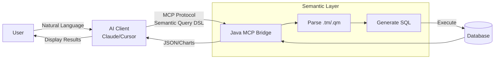

# Java Data MCP Bridge

[中文文档](README.zh-CN.md)

**MCP Data Query Bridge Layer** - Enable AI to query business data safely and accurately through a semantic layer.

[](LICENSE)
[](https://openjdk.org/)
[](https://spring.io/projects/spring-boot)

## Why Not Let AI Write SQL Directly?

Having LLMs generate SQL directly has several core problems:

| Problem | Description |
|---------|-------------|
| **Security Risk** | AI might generate DELETE, UPDATE, or access sensitive tables, difficult to constrain effectively |
| **Schema Exposure** | Complete table structure must be provided to AI, leaking internal design details |
| **Missing Business Semantics** | What does `order_status=3` mean? AI doesn't know, and users don't want to care |
| **Complex JOINs Error-Prone** | Multi-table joins and aggregation logic are easy to get wrong, high debugging cost |
| **Database Dialect Differences** | MySQL, SQL Server, MongoDB have different syntax, AI needs separate adaptation for each |

**This project's solution**: Add a **semantic layer** between AI and the database. AI only needs to select "which fields to query" and "how to filter", and the semantic layer handles generating correct SQL.

## Architecture



## Core Features

- **Declarative Data Models** - Define business semantics with TM/QM files, AI can only access authorized fields
- **Automatic SQL Generation** - Framework handles multi-table JOINs, aggregations, pagination; AI doesn't need to understand complex schemas
- **MCP Protocol Integration** - Out-of-box integration with Claude Desktop, Cursor, and other AI clients
- **Multi-Database Support** - MySQL, PostgreSQL, SQL Server, SQLite
- **Access Control** - Restrict queryable models and fields by role

## Quick Start

### Docker One-Click Launch

```bash
git clone https://github.com/foggy-projects/foggy-data-mcp-bridge.git
cd foggy-data-mcp-bridge/docker/demo

cp .env.example .env
# Edit .env to set OPENAI_API_KEY

docker compose up -d
```

Configure in Claude Desktop:

```json
{
  "mcpServers": {
    "foggy-dataset": {
      "url": "http://localhost:7108/mcp/analyst/rpc"
    }
  }
}
```

Then query directly with natural language:
- "Query sales data for the last week, summarized by brand"
- "What products had the highest return rate last month"

## How It Works

### 1. Define Data Model (TM)

```javascript
// FactSalesModel.tm
export const model = {
    name: 'FactSalesModel',
    caption: 'Sales Data',
    tableName: 'fact_sales',

    dimensions: [{
        name: 'product',
        tableName: 'dim_product',
        foreignKey: 'product_key',
        caption: 'Product',
        properties: [
            { column: 'brand', caption: 'Brand' },
            { column: 'category_name', caption: 'Category' }
        ]
    }],

    measures: [
        { column: 'quantity', caption: 'Quantity', aggregation: 'sum' },
        { column: 'sales_amount', caption: 'Sales Amount', aggregation: 'sum' }
    ]
};
```

### 2. AI Initiates Semantic Query

AI doesn't need to know the table structure, just send a request like this:

```json
{
  "queryModel": "FactSalesQueryModel",
  "columns": ["product$brand", "salesAmount"],
  "filters": [{ "column": "orderDate", "op": ">=", "value": "2024-01-01" }],
  "orders": [{ "column": "salesAmount", "desc": true }],
  "limit": 10
}
```

### 3. Framework Generates and Executes SQL

```sql
SELECT p.brand, SUM(f.sales_amount) as salesAmount
FROM fact_sales f
LEFT JOIN dim_product p ON f.product_key = p.product_key
WHERE f.order_date >= '2024-01-01'
GROUP BY p.brand
ORDER BY salesAmount DESC
LIMIT 10
```

## Module Structure

```
foggy-data-mcp-bridge/
├── foggy-dataset-model     # Core: Semantic Layer Engine
├── foggy-dataset-mcp       # MCP Server
├── foggy-dataset-demo      # Sample Data Models
├── foggy-dataset           # Multi-Database Adapter
├── foggy-fsscript          # TM/QM Parser
└── foggy-core              # Base Utilities
```

## Documentation

- [TM/QM Syntax Manual](foggy-dataset-model/docs/guide/TM-QM-Syntax-Manual.md)
- [IDE Local Development](foggy-dataset-mcp/docs/IDE-Development.md)
- [Access Control](foggy-dataset-model/docs/security/Authorization-Control.md)

## License

[Apache License 2.0](LICENSE)
