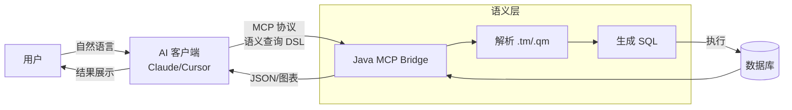

# Java Data MCP Bridge

**MCP 数据查询桥接层** - 让 AI 通过语义层安全、精准地查询业务数据。

[](LICENSE)
[](https://openjdk.org/)
[](https://spring.io/projects/spring-boot)

## 为什么不直接让 AI 写 SQL？

让 LLM 直接生成 SQL 存在几个核心问题：

| 问题 | 说明 |
|------|------|
| **安全风险** | AI 可能生成 DELETE、UPDATE 或访问敏感表，难以有效约束 |
| **Schema 暴露** | 需要将完整表结构提供给 AI，泄露内部设计细节 |
| **业务语义缺失** | `order_status=3` 是什么意思？AI 不知道，用户也不想关心 |
| **复杂 JOIN 易错** | 多表关联、聚合逻辑容易出错，调试成本高 |
| **数据库方言差异** | MySQL、SQL Server、MongoDB 语法各异，AI 需针对每种单独适配 |

**本项目的解决方案**：在 AI 和数据库之间增加一个**语义层**，AI 只需要选择「查哪些字段」「怎么过滤」，由语义层负责生成正确的 SQL。

## 架构原理



## 核心特性

- **声明式数据模型** - 用 TM/QM 文件定义业务语义，AI 只能访问已授权的字段
- **Model-as-Code (模型即代码)** - 使用 JavaScript 定义数据模型，支持函数复用、动态权限控制和复杂的计算逻辑，远比静态的 JSON/YAML 灵活。
- **自动 SQL 生成** - 框架处理多表 JOIN、聚合、分页，无需 AI 理解复杂 Schema
- **MCP 协议集成** - 开箱即用对接 Claude Desktop、Cursor 等 AI 客户端
- **多数据库支持** - MySQL、PostgreSQL、SQL Server、SQLite
- **权限控制** - 按角色限制可查询的模型和字段

## 快速体验

### Docker 一键启动

```bash
git clone https://github.com/foggy-projects/foggy-data-mcp-bridge.git
cd foggy-data-mcp-bridge/docker/demo

cp .env.example .env
# 编辑 .env 设置 OPENAI_API_KEY

docker compose up -d
```

在 Claude Desktop 中配置：

```json
{
  "mcpServers": {
    "foggy-dataset": {
      "url": "http://localhost:7108/mcp/analyst/rpc"
    }
  }
}
```

然后直接用自然语言查询：
- "查询最近一周的销售数据，按品牌汇总"
- "上个月退货率最高的商品有哪些"

## 工作原理

### 1. 定义数据模型（TM）

```javascript
// FactSalesModel.tm
export const model = {
    name: 'FactSalesModel',
    caption: '销售数据',
    tableName: 'fact_sales',

    dimensions: [{
        name: 'product',
        tableName: 'dim_product',
        foreignKey: 'product_key',
        caption: '商品',
        properties: [
            { column: 'brand', caption: '品牌' },
            { column: 'category_name', caption: '品类' }
        ]
    }],

    measures: [
        { column: 'quantity', caption: '销量', aggregation: 'sum' },
        { column: 'sales_amount', caption: '销售额', aggregation: 'sum' }
    ]
};
```

### 2. AI 发起语义查询

AI 不需要知道表结构，只需发起这样的请求：

```json
{
  "queryModel": "FactSalesQueryModel",
  "columns": ["product$brand", "salesAmount"],
  "filters": [{ "column": "orderDate", "op": ">=", "value": "2024-01-01" }],
  "orders": [{ "column": "salesAmount", "desc": true }],
  "limit": 10
}
```

### 3. 框架生成 SQL 并执行

```sql
SELECT p.brand, SUM(f.sales_amount) as salesAmount
FROM fact_sales f
LEFT JOIN dim_product p ON f.product_key = p.product_key
WHERE f.order_date >= '2024-01-01'
GROUP BY p.brand
ORDER BY salesAmount DESC
LIMIT 10
```

## 模块结构

```
foggy-data-mcp-bridge/
├── foggy-dataset-model     # 核心：语义层引擎
├── foggy-dataset-mcp       # MCP 服务端
├── foggy-dataset-demo      # 示例数据模型
├── foggy-dataset           # 多数据库适配
├── foggy-fsscript          # TM/QM 解析器
└── foggy-core              # 基础工具
```

## 文档

- [TM/QM 语法手册](foggy-dataset-model/docs/guide/TM-QM-Syntax-Manual.md)
- [IDE 本地开发](foggy-dataset-mcp/docs/IDE-Development.zh-CN.md)
- [权限控制](foggy-dataset-model/docs/security/Authorization-Control.md)

## 许可证

[Apache License 2.0](LICENSE)
