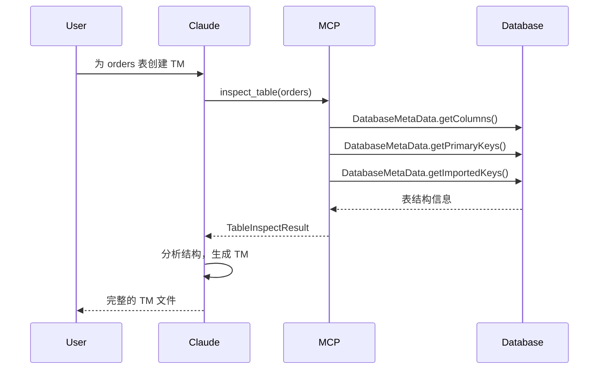

# inspect_table 工具

`dataset.inspect_table` 工具用于从数据库直接获取表结构元数据，辅助 AI 生成 TM/QM 模型文件。

## 功能概述

该工具通过 JDBC DatabaseMetaData API 获取数据库表的真实结构信息，包括：

- 列信息（名称、类型、长度、是否可空）
- 主键信息
- 外键关系
- 索引信息
- 推断的 TM 类型映射

## 使用场景

```
用户: "帮我为 orders 表创建一个 TM 文件"
AI:   [调用 dataset.inspect_table 获取表结构]
      [根据返回的元数据生成 TM 文件]
```

## 参数说明

| 参数 | 类型 | 必填 | 说明 |
|------|------|------|------|
| `table_name` | string | 是 | 要检查的表名 |
| `schema` | string | 否 | 数据库 Schema（可选，默认使用连接的默认 Schema） |
| `include_indexes` | boolean | 否 | 是否包含索引信息（默认 false） |
| `include_foreign_keys` | boolean | 否 | 是否包含外键关系（默认 true） |
| `include_sample_data` | boolean | 否 | 是否包含样例数据用于推断字典（默认 false，最多10条） |

## 返回结构

```json
{
  "table_name": "fact_sales",
  "schema": "ecommerce",
  "catalog": "mydb",
  "comment": "销售事实表",

  "columns": [
    {
      "name": "sales_key",
      "sql_type": "BIGINT",
      "jdbc_type": -5,
      "tm_type": "BIGINT",
      "length": 20,
      "precision": 20,
      "scale": 0,
      "nullable": false,
      "auto_increment": true,
      "default_value": null,
      "comment": "主键",
      "is_primary_key": true,
      "suggested_role": "property"
    },
    {
      "name": "customer_key",
      "sql_type": "INT",
      "jdbc_type": 4,
      "tm_type": "INTEGER",
      "length": 11,
      "nullable": false,
      "is_foreign_key": true,
      "references": {
        "table": "dim_customer",
        "column": "customer_key"
      },
      "suggested_role": "dimension"
    },
    {
      "name": "sales_amount",
      "sql_type": "DECIMAL",
      "jdbc_type": 3,
      "tm_type": "MONEY",
      "precision": 12,
      "scale": 2,
      "nullable": false,
      "suggested_role": "measure",
      "suggested_aggregation": "sum"
    }
  ],

  "primary_key": {
    "name": "PRIMARY",
    "columns": ["sales_key"]
  },

  "foreign_keys": [
    {
      "name": "fk_customer",
      "column": "customer_key",
      "references_table": "dim_customer",
      "references_column": "customer_key",
      "suggested_dimension_name": "customer"
    },
    {
      "name": "fk_date",
      "column": "date_key",
      "references_table": "dim_date",
      "references_column": "date_key",
      "suggested_dimension_name": "salesDate"
    }
  ],

  "indexes": [
    {
      "name": "idx_date_customer",
      "columns": ["date_key", "customer_key"],
      "unique": false
    }
  ],

  "suggested_model_type": "fact",
  "suggested_model_name": "FactSalesModel",

  "tm_template": "// 基于表结构自动生成的 TM 模板\nexport const model = {\n    name: 'FactSalesModel',\n    ..."
}
```

## 字段角色推断规则

| 条件 | 推断角色 | 说明 |
|------|----------|------|
| 列名含 `_key`, `_id` + 有外键约束 | `dimension` | 维度关联 |
| 列名含 `_key`, `_id` + 无外键 + 是主键 | `property` | 本表主键 |
| 类型为 DECIMAL/NUMERIC + 列名含 amount/price/cost/total | `measure` | 金额度量 |
| 类型为 INT + 列名含 qty/quantity/count | `measure` | 数量度量 |
| 类型为 VARCHAR/TEXT | `property` | 文本属性 |
| 类型为 DATE/DATETIME/TIMESTAMP | `property` | 时间属性 |

## TM 类型映射

| JDBC Type | SQL Type | TM Type | 说明 |
|-----------|----------|---------|------|
| BIGINT (-5) | BIGINT | `BIGINT` | 长整数 |
| INTEGER (4) | INT | `INTEGER` | 整数 |
| DECIMAL (3) | DECIMAL | `MONEY` | 金额 |
| VARCHAR (12) | VARCHAR | `STRING` | 字符串 |
| DATE (91) | DATE | `DAY` | 日期 |
| TIMESTAMP (93) | DATETIME | `DATETIME` | 日期时间 |
| BOOLEAN (16) | BOOLEAN | `BOOL` | 布尔 |

## 权限控制

该工具属于 `METADATA` 类别：
- **ANALYST** 角色：可访问
- **ADMIN** 角色：可访问
- **BUSINESS** 角色：不可访问

## 安全考虑

1. **Schema 限制**：可配置允许访问的 Schema 白名单
2. **表名过滤**：可配置表名模式（如排除 `sys_*`）
3. **敏感列屏蔽**：自动屏蔽可能包含敏感信息的列（password, token 等）

## 配置示例

```yaml
mcp:
  tools:
    - name: "dataset.inspect_table"
      enabled: true
      descriptionFile: "classpath:/schemas/descriptions/inspect_table.md"
      schemaFile: "classpath:/schemas/inspect_table_schema.json"
      category: METADATA

  # 表检查工具安全配置
  inspect:
    allowed-schemas:
      - public
      - ecommerce
    excluded-tables:
      - "sys_*"
      - "*_log"
    masked-columns:
      - password
      - token
      - secret
```

## 与现有工具的关系

| 工具 | 数据来源 | 用途 |
|------|----------|------|
| `dataset.get_metadata` | TM/QM 文件 | 查询已定义的模型元数据 |
| `dataset.describe_model_internal` | TM/QM 文件 | 查看单个模型详情 |
| **`dataset.inspect_table`** | **数据库** | **从数据库反向获取表结构** |

## 工作流示例


