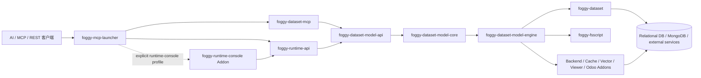

# Foggy Data MCP Bridge 架构

本目录是仓库“当前有效架构”的唯一入口，描述 `main` 上已经成立的系统边界、模块职责、
运行时流程与扩展契约。

版本目录 `docs/{version}/` 只记录该版本的需求、方案差异、迁移、验证和验收事实。迭代文档
可以引用本目录，但不应复制一份会继续漂移的完整架构。

## 文档地图

- [系统总览](system-overview.md)：系统上下文、逻辑分层、部署形态、接口与信任边界。
- [模块边界](module-boundaries.md)：Maven 模块职责、依赖方向和禁止事项。
- [运行时与模型生命周期](runtime-and-model-lifecycle.md)：namespace、数据源、Bundle、模型发布和查询流程。
- [Model SPI v2 与扩展](extension-spi.md)：稳定查询 API、provider capability、catalog 和 TCK 契约。
- [Runtime 内生权限与预聚合](runtime-permissions-and-preaggregation.md)：Runtime API 直连与可信宿主的
  权限边界、TM/QM 内生权限目标，以及行权限对预聚合候选的约束。
- [Runtime Console 产品章程](../design/runtime-console-product-charter.md)：Console 的目标用户、产品定位、
  信息架构、视觉原则和跨迭代能力边界。
- [`totalData` 代数聚合状态设计](../design/totaldata-algebraic-aggregate-state-design.md)：AVG 的
  SUM/COUNT 状态 lowering、结果阶段透传、total merge/finalize 与预聚合安全回退契约。

专题设计仍可保留在 `docs/design/` 或对应版本目录，但必须明确它是专题说明还是历史决策，
不能替代这里的整体架构。

## 架构一览

图中箭头表达主要运行时调用关系，不是每个 POM 的完整依赖图。精确模块依赖以根
`pom.xml` 和各模块 `pom.xml` 为准。

## 当前架构基线

- Java 17，Spring Boot 3.4.5，Maven 多模块 reactor。
- 9.5.0 后不存在旧 Maven 聚合模块 `foggy-dataset-model`；物理语义引擎是
  `foggy-dataset-model-engine`。
- 稳定查询与 backend 扩展契约位于 JDK-only `foggy-dataset-model-api`。
- 当前生产包根是 `com.foggyframework.dataset.model.*`；旧
  `com.foggyframework.dataset.db.model.*` 已退出。
- provider capability 必须与实际实现角色一致；重复 identity、缺少 provider、
  缺少 capability 和 capability/role 不匹配都显式失败。
- namespace 是模型加载、查询、刷新和 catalog identity 的隔离不变量，不是可选 capability。
- Bundle 注册、模型验证和模型刷新是三个独立动作；注册成功不代表模型已经发布。
- 模型刷新采用 candidate build/validate/admit 后原子发布，不能让查询看到半完成状态。
- 语义字段白名单 `fieldAccess` 在查询规划前 fail closed；物理列黑名单
  `deniedColumns` 在 SQL 构建后、执行前 fail closed。
- `fieldAccess`、`deniedColumns`、`systemSlice` 是可信宿主到引擎的治理上下文，不是
  Runtime API 普通用户可提交的查询 DSL。
- Runtime API 直连只透明传递可选 opaque token，并建立非空匿名或 opaque-subject identity；
  TM/QM 未声明权限时模型公开，声明权限时由模型作者按 action/resource 返回模型、字段和
  structured row permission decision。
- `get/post` 属于已发布 TM/QM 的作者能力，不向 Runtime 查询 DSL、Compose 或 CTE 调用方开放。
- CLI 保留管理 `--auth-code`，另增可选数据面 Authorization；配套中英文 analysis Skill 与
  semantic-query Skill 必须同步说明权限、TM/QM 配置和预聚合安全回源。
- 使用完整 evaluator 的原始 FSScript execute 属于作者/管理面，已纳入管理 auth-code 保护。
- Runtime API 默认 `auth-scope=mutations` 保持历史兼容；显式 `management-all` 会保护全部
  `/api/v1/**`，并是可选同源 Runtime Console 的强制启用前提。Console token 只保存在当前 tab
  的 `sessionStorage`，不能替代数据面 `Authorization`。
- 当前该链路仍有待补齐的 token/identity 传递、动作化模型决策、结构化行权限、成员查询隔离和
  引擎授权签名能力。
- 预聚合候选只有在能够完整表达有效行权限谓词时才可命中；否则跳过该候选并执行受治理的
  源表查询。
- 预聚合构建不得继承单个用户权限后作为全局表共享；现有表按 `GLOBAL` 语义处理，
  `SECURITY_SCOPED` 未完整实现时必须拒绝配置。
- 新权限语法采用 opt-in：存量 TM/QM 无需迁移，未声明权限时保持开放；行权限无法由旧预聚合
  等价表达时只允许改变路由并安全回源，不能改变授权结果。

## 文档维护规则

以下变更必须在同一个变更集中更新本目录：

- 新增、删除或重新定位 Maven 模块；
- 改变公开 API/SPI、provider capability 或 TCK 契约；
- 改变 namespace、数据源绑定、Bundle、模型发布或查询主流程；
- 改变部署拓扑、认证边界或数据权限边界；
- 引入新的持久化 backend、缓存、memory-grid 或远程执行路径。

版本验收文档是不可改写的历史证据。架构演进后更新本目录，不回写旧版本的签收结论。
