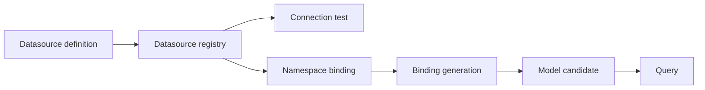
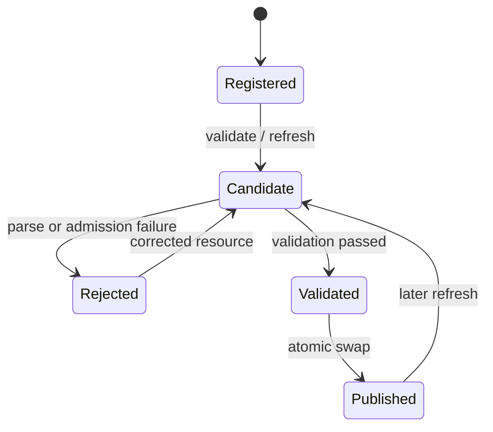

# 运行时与模型生命周期

## 1. 运行时状态模型

运行时的关键 identity 不是单一模型名，而是至少由以下上下文共同决定：

- namespace；
- 数据源 identity 与 binding generation；
- Bundle/resource revision；
- model catalog generation；
- backend provider identity。

任何缓存、catalog 或异步任务如果遗漏这些维度，都可能造成跨 namespace 串读或读取过期模型。

## 2. Namespace

Namespace 是数据源绑定、Bundle、TM/QM、查询、刷新和 provider 请求的隔离轴。HTTP 调用中
主要通过 `X-NS` 传递；Dataset Native REST 还允许 body namespace。当前兼容优先级为：

```text
X-NS header
  > body.namespace
  > foggy.dataset.request.default-namespace
  > empty namespace
```

新接口应优先显式传递 namespace，不依赖隐式空 namespace。namespace isolation 是所有
load/query/refresh 路径的强制不变量，不通过 capability 开关决定。

## 3. 数据源与 namespace binding



- 数据源定义和连接测试是独立动作。
- namespace binding 指向数据源 identity，并带有可观察的 generation/convergence 状态。
- binding 改变后，依赖旧数据源的模型不能静默继续作为新 generation 的有效模型。
- diagnostics 可报告状态，但不得返回连接密码等秘密。

## 4. Bundle 与资源

Bundle 是一组可注册的模型资源来源。注册动作负责登记资源，不隐式承诺资源能够成功编译或已
对查询可见。

同一 namespace 内，Bundle 注册前必须检查 TM/QM canonical name 冲突。检查或资源读取失败时
拒绝变更；不能先部分写入再尝试修复。

Bundle 生命周期：

```text
register/update resource
  → inspect and conflict-check
  → persist registry state
  → explicit validate
  → explicit refresh
  → atomically publish catalog generation
```

删除 Bundle 同样要通过模型生命周期服务收敛，避免 catalog、资源注册表和查询缓存各自持有
不同事实。

## 5. 模型验证与原子刷新

验证与刷新必须区分：

- validate：解析资源、建立 candidate、执行结构/语义检查，返回诊断，不替换当前模型。
- refresh：重新构建 candidate，完成 validation/admission 后一次性发布新 catalog generation。



刷新失败时，已发布 generation 保持可用；查询不能观察到半构建 candidate。成功刷新后，
catalog identity、namespace、source revision、binding generation 和发布 generation 必须一致。

## 6. Request-local candidate 与 authoring workspace

9.5.3 增加了 engine/Runtime 内部 candidate execution port，以及建立在该端口上的 Runtime-local
authoring workspace 与 publish/recovery API。candidate port 对一个不可变草稿 Bundle revision 执行
validate 和普通 JDBC semantic query；workspace API 负责持久草稿、revision、diff、完整验证和受治理
查询；publish API 把 exact validated revision 提升为 Runtime-managed immutable Bundle artifact，并完成
失败补偿。

该路径遵循以下不变量：

- Runtime 入口只接受 enabled Runtime-managed external Bundle，并校验目标 Namespace；
- 草稿 identity 是 TM/QM/FSScript 相对路径与字节的内容寻址 revision，同时固定创建时的
  Namespace source revision；
- detached production loader 构造 request-local TM/QM/FSScript、catalog resolution 和只读
  Bundle view；validate 与 execute 固定使用同一个 model instance 和 catalog identity；
- source overlay 只可替换 selected Bundle 自身的 TM/QM/FSScript；遮蔽其他 Runtime-managed、configured
  external 或 JAR/classpath Bundle 的同名资源必须 fail closed；
- 数据源、opaque Authorization、模型动作权限、字段/行权限、物理列 guard 和 JDBC 执行继续
  复用目标 Namespace 的既有流水线；
- candidate 禁用共享 L1/L2 cache、pre-aggregation 和 hybrid query，不发布 catalog，不修改
  Bundle inventory 或 committed source revision；
- 每次语义调用前后都重新检查 live source revision 和草稿内容 revision；任一漂移返回稳定 stale
  错误，不能回退到 live 同名模型；
- pivot、Compose/CTE、Semantic SQL、memory-grid、synthetic member 等尚未具备完整 request-local
  dependency pin 的模式显式拒绝；session close 释放候选 model/catalog/script 引用。

该机制不创建临时 Namespace，也不把 candidate catalog 持久化为第二套运行时真值。

Runtime authoring workspace 进一步遵循以下边界：

- 一个 workspace 固定一个显式 Namespace 和一个 enabled Runtime-managed external filesystem Bundle；
  configured external、JAR/classpath、inactive、路径不一致或含 symlink 的来源不可创建 workspace；
- create 复制 `.tm`、`.qm`、`.fsscript` 的完整 base snapshot，同时固定 Bundle content revision、
  Namespace committed source revision 和 opaque source identity；复制窗口任一来源漂移都不留下 workspace；
- base 与 current candidate 都是 canonical content hash 标识的 immutable revision。save/delete 先完整校验
  path、类型、overlay、quota 和 expected head，再 staging、原子提交 metadata/head；同一进程内竞争只允许
  一个请求提交；
- `DRAFT`、`VALIDATED`、`STALE`、`PUBLISHING`、`RECOVERY_REQUIRED`、`PUBLISHED`、`DISCARDED`
  是当前完整状态集。内容变化使 validation evidence 失效；source content/identity/committed revision
  漂移持久转为 `STALE`；`PUBLISHED` 与 `DISCARDED` 是终态；
- validate 遍历全部 FSScript、TM 和 QM。query validate/execute 只接受 exact current、已完成完整验证的
  revision，并由服务端组装 immutable candidate path、source Bundle、Namespace 与 base source revision；
- 每个 workspace route 都要求 Runtime 管理 auth-code；业务 `Authorization` 仅独立透传给 candidate 数据面，
  不能代替或提升管理认证；
- store 是 ownership-bearing v2 Runtime-local filesystem state：`workspaces.json` 固定 opaque `storeId`，
  每个 workspace directory 都有匹配 marker。不存在或严格空 root 才能初始化；合法 v1 store 经完整
  只读校验后幂等迁移，foreign/unknown entry 保留并 fail closed，cleanup 只删除 ownership 与内部类型均
  可证明的 orphan/staging/revision；
- authoring store root 与 configured、active/inactive Runtime-managed direct-filesystem Bundle source 必须
  在相等、祖先、后代和 symlink identity 上双向 disjoint。startup restore、Bundle add/update/enable 和
  store 初始化都在首个 source/store mutation 前检查；path traversal、非严格 UTF-8、case collision、
  symlink、quota、hash/metadata corruption 同样 fail closed；多进程或共享 NFS writer不在当前一致性承诺内；
- validate/query 的成功、失败、权限拒绝、database failure、revision/source race 和 close 均不能修改 live
  catalog、共享 FSScript/query cache、Bundle inventory 或 committed source revision。

authoring publish/recovery 进一步遵循以下不变量：

- `POST /authoring/workspaces/{workspaceId}/publish` 只接受 current、exact、完整验证通过的 candidate、
  base Bundle revision 和 base Namespace source revision；目标 Namespace、Bundle 和 filesystem path 全部由
  服务端从 workspace identity 解析；
- candidate 先复制到独立 ownership-bearing published root，形成只含 `.tm`、`.qm`、`.fsscript` 的
  immutable content-addressed artifact。foreign root、symlink、未知 layout、manifest 或 hash 不一致都
  fail closed，不猜测或删除现场；
- immutable 约束的是已发布 artifact 的字节不可原地修改，不表示 Bundle lifecycle 永久不能升级。只有
  registry/live source 当前共同指向 Runtime-owned、状态为 `PUBLISHED` 且 Bundle、Namespace、revision、
  path、manifest/hash 全部匹配的 artifact，才可作为下一 workspace 的 publication base；校验失败必须在
  新 artifact、durable intent 或 live mutation 前拒绝；
- 首次 live mutation 前必须持久化 publication attempt 和 workspace `PUBLISHING` evidence。随后在同一
  单进程 publication lock 内切换唯一 Bundle source、持久化 registry、执行 full-Namespace atomic refresh，
  最后才把 workspace 标记为 terminal `PUBLISHED`；
- 任一 source、registry、refresh 或最终 evidence 失败都返回失败并优先恢复 exact base source、registry
  与 full-Namespace catalog。不能证明恢复时保留 durable evidence 并进入 `RECOVERY_REQUIRED`；restart
  只收敛状态，不自动覆盖未知 live source；
- `POST .../publish/recover` 必须固定同一 attempt 和 candidate，只能恢复该失败 attempt 记录的 base。
  live/registry identity 出现第三方漂移时返回 conflict 且 `safeToAutoRepair=false`；恢复成功后 workspace
  为 `STALE`，保留 candidate 和 publication evidence；
- published Bundle 固定 `watch=false`，inventory 明示 immutable artifact revision，现有低层 resource
  save 返回只读错误；Bundle replace/remove 可以改变 registry/source，但不能修改或删除 artifact。用户仍可
  从当前 published Bundle 创建新的 workspace，下一次成功 publish 只追加新 immutable artifact 并切换
  current registry/source，上一 artifact 继续保持原字节与 manifest；
- publish/recover、Bundle add/update/remove 和低层 resource save 共享同一单进程互斥边界。多进程、
  shared NFS writer、artifact GC 和成功发布后的历史 rollback 不在当前承诺内。

当前 API 仍不提供 revision history、rebase/merge、成功发布后的 rollback、release package、生产
promotion、Git、JAR fork/binding 或高级 candidate query mode。这些需要后续独立 lifecycle workitem，
不能从一次 Runtime-local publish 推断为跨环境发布能力。

## 7. 查询与执行

主流程：

1. 接入层确定信任模式并建立 namespace/security context：Runtime API 直连透明携带可选
   opaque token 并建立非空 `RequestIdentity`，可信宿主可以通过内部契约传入治理上下文。
2. 将协议请求规范化为稳定 QueryFacade DTO 或 engine 内部高级请求。
3. catalog 按 provider identity 和 QUERY capability 解析 typed provider。
4. engine 加载对应 namespace 的已发布模型。
5. 若 QM 声明模型权限解析器，由模型作者使用平台 `get/post` 或其他受信模型函数解释 token，
   按 action/resource 返回显式 `allow`、attributes 和 typed row predicates；未声明时按开放
   模型处理。
6. 在每个叶子 QM 的 scan 前执行模型动作权限、TM/QM 字段权限和有效行权限编译。
7. 引擎根据最终模型、字段、行决策和 generation 计算 `authorizationSignature`；元数据、成员和
   数据缓存都使用该签名隔离。
8. 使用“业务查询 + 行权限谓词”构建预聚合 requirement；无法保留权限粒度的预聚合候选
   被跳过。
9. 生成源表 SQL、预聚合 SQL 或 compose/memory-grid 执行计划。
10. 可信宿主模式下，在 SQL 构建后、执行前执行 `deniedColumns` 物理列检查。
11. 执行数据源查询，完成 pivot/整形/分页等结果处理。
12. 返回稳定结果或显式错误。

Compose、pivot、semantic planner 和 memory-grid routing 是 engine 能力，不是 Model SPI v2
公共扩展点。外部消费者若只需查询，应使用 QueryFacade，而不是依赖这些内部类型。

原始 `/api/v1/fsscript/execute` 不属于上述数据查询流。它使用完整 evaluator 时具备模型作者级
脚本能力，必须放在作者/管理面并由管理凭据保护；普通查询身份不能借该入口执行 `get/post` 或
导入宿主 Bean。

## 8. 缓存与失效

查询缓存 provider 当前只声明 `CACHE_INVALIDATION`。这表示它实现按契约触发失效，不表示它
拥有模型加载、原子刷新或 namespace 管理能力。

模型发布、Bundle 变更、数据源 binding generation 改变等事件需要在相应边界触发失效。
失效请求必须携带足够 identity；无法确定失效范围时应保守拒绝或扩大到安全范围，不能保留
已知可能跨代命中的缓存。

权限相关查询、元数据和维度成员缓存还必须绑定引擎计算的 `authorizationSignature`，有效期不
超过权限决策 expiry。预聚合物理表默认按 `GLOBAL` 处理，不能使用某个用户权限快照构建后全局
共享；`SECURITY_SCOPED` 未完整实现 scope identity、刷新和匹配时必须 fail fast。

## 9. 错误契约

以下情况必须显式、可诊断地失败：

- provider identity 重复或缺失；
- 请求 capability 未声明；
- capability 已声明但 provider 未实现对应 role；
- namespace、数据源 binding、模型或 generation 不存在/不一致；
- Bundle canonical name 冲突；
- 模型 candidate 解析、验证或 admission 失败；
- 权限表达式无法解析，或引用了未授权语义字段/物理列；
- 受保护模型的权限解析器拒绝、失败或返回非法决策，或权限谓词执行失败；
- 原子刷新无法完成。

禁止通过选择“第一个 provider”、回退空 namespace、忽略未知权限表达式或继续使用半更新状态来
掩盖错误。
