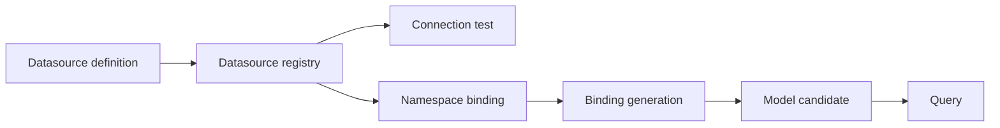
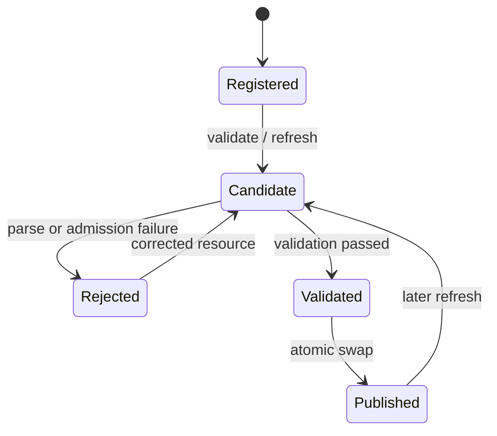

# 运行时与模型生命周期

## 1. 运行时状态模型

运行时的关键 identity 不是单一模型名，而是至少由以下上下文共同决定：

- namespace；
- 数据源 identity 与 binding generation；
- Bundle/resource revision；
- model catalog generation；
- backend provider identity。

任何缓存、catalog 或异步任务如果遗漏这些维度，都可能造成跨 namespace 串读或读取过期模型。

## 2. Namespace

Namespace 是数据源绑定、Bundle、TM/QM、查询、刷新和 provider 请求的隔离轴。HTTP 调用中
主要通过 `X-NS` 传递；Dataset Native REST 还允许 body namespace。当前兼容优先级为：

```text
X-NS header
  > body.namespace
  > foggy.dataset.request.default-namespace
  > empty namespace
```

新接口应优先显式传递 namespace，不依赖隐式空 namespace。namespace isolation 是所有
load/query/refresh 路径的强制不变量，不通过 capability 开关决定。

## 3. 数据源与 namespace binding



- 数据源定义和连接测试是独立动作。
- namespace binding 指向数据源 identity，并带有可观察的 generation/convergence 状态。
- binding 改变后，依赖旧数据源的模型不能静默继续作为新 generation 的有效模型。
- diagnostics 可报告状态，但不得返回连接密码等秘密。

## 4. Bundle 与资源

Bundle 是一组可注册的模型资源来源。注册动作负责登记资源，不隐式承诺资源能够成功编译或已
对查询可见。

同一 namespace 内，Bundle 注册前必须检查 TM/QM canonical name 冲突。检查或资源读取失败时
拒绝变更；不能先部分写入再尝试修复。

Bundle 生命周期：

```text
register/update resource
  → inspect and conflict-check
  → persist registry state
  → explicit validate
  → explicit refresh
  → atomically publish catalog generation
```

删除 Bundle 同样要通过模型生命周期服务收敛，避免 catalog、资源注册表和查询缓存各自持有
不同事实。

## 5. 模型验证与原子刷新

验证与刷新必须区分：

- validate：解析资源、建立 candidate、执行结构/语义检查，返回诊断，不替换当前模型。
- refresh：重新构建 candidate，完成 validation/admission 后一次性发布新 catalog generation。



刷新失败时，已发布 generation 保持可用；查询不能观察到半构建 candidate。成功刷新后，
catalog identity、namespace、source revision、binding generation 和发布 generation 必须一致。

## 6. 查询与执行

主流程：

1. 接入层鉴权并建立 namespace/security context。
2. 将协议请求规范化为稳定 QueryFacade DTO 或 engine 内部高级请求。
3. catalog 按 provider identity 和 QUERY capability 解析 typed provider。
4. engine 加载对应 namespace 的已发布模型。
5. 在规划前执行 `fieldAccess`、QM 可见列和其他语义约束。
6. 生成 SQL 或 compose/memory-grid 执行计划。
7. 在 SQL 构建后、执行前执行 `deniedColumns` 物理列检查。
8. 执行数据源查询，完成 pivot/整形/分页等结果处理。
9. 返回稳定结果或显式错误。

Compose、pivot、semantic planner 和 memory-grid routing 是 engine 能力，不是 Model SPI v2
公共扩展点。外部消费者若只需查询，应使用 QueryFacade，而不是依赖这些内部类型。

## 7. 缓存与失效

查询缓存 provider 当前只声明 `CACHE_INVALIDATION`。这表示它实现按契约触发失效，不表示它
拥有模型加载、原子刷新或 namespace 管理能力。

模型发布、Bundle 变更、数据源 binding generation 改变等事件需要在相应边界触发失效。
失效请求必须携带足够 identity；无法确定失效范围时应保守拒绝或扩大到安全范围，不能保留
已知可能跨代命中的缓存。

## 8. 错误契约

以下情况必须显式、可诊断地失败：

- provider identity 重复或缺失；
- 请求 capability 未声明；
- capability 已声明但 provider 未实现对应 role；
- namespace、数据源 binding、模型或 generation 不存在/不一致；
- Bundle canonical name 冲突；
- 模型 candidate 解析、验证或 admission 失败；
- 权限表达式无法解析，或引用了未授权语义字段/物理列；
- 原子刷新无法完成。

禁止通过选择“第一个 provider”、回退空 namespace、忽略未知权限表达式或继续使用半更新状态来
掩盖错误。
