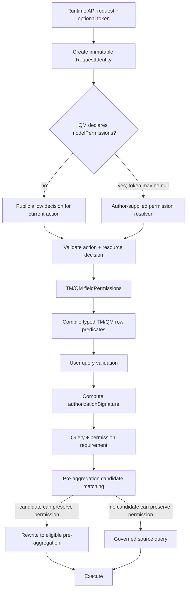

# Runtime 内生权限与预聚合

## 1. 决策范围

Foggy 存在两种不同的权限接入模式，二者必须保持明确的信任边界。

### 1.1 Runtime API 直连：模型作者控制的内生权限

用户可以直接调用 Runtime API 的模型列表、模型描述、查询验证和查询执行接口。此模式下：

- 调用方只提交业务查询 DSL、目标模型、namespace，并可通过 `Authorization` Header 传递
  opaque token；
- token 不是 Runtime 查询面的全局必填项。TM/QM 没有声明权限策略时，该模型就是作者明确
  发布的开放模型，无 token 也允许访问；
- Runtime 为每个数据面请求建立非空、只读的 `RequestIdentity`：无 Header 时为
  `ANONYMOUS`，存在 Header 时为 `OPAQUE_SUBJECT`。管理面 principal 使用独立认证上下文，
  不能因为持有管理凭据就自动变成数据面的全量身份；
- Runtime 只负责把 Header 中的 token 原样、安全地放入只读请求上下文，不规定 token
  格式，也不统一解析为角色、租户或部门；
- 模型作者通过已发布的 TM/QM 和平台提供的 `get`/`post` 等能力决定是否调用业务权限系统、
  如何解释 token，以及如何形成模型、列和行权限；
- 一旦模型声明了权限解析器，即使 token 为空也要执行该解析器。解析器可以显式允许匿名访问；
  但返回空结果、非法结果或执行失败时，只对该受保护模型 fail closed；
- 调用方不能在请求体或 DSL 中提交 `fieldAccess`、`deniedColumns`、`systemSlice`、
  `policySnapshotId` 等治理参数。

这是本文关注的主要权限模式。

### 1.2 管理面与数据查询面

Runtime API 的管理面具备数据源、Bundle、TM/QM 验证、刷新和发布等技术能力。持有管理凭据的
调用方属于可信运维主体，可以改变 namespace 中的模型定义，因此技术上具有最大管理权限。

管理权限不自动等于某次数据查询的业务权限：

- 管理 auth code 或管理 token 用于控制模型和运行时状态；
- 数据面的 list/describe/validate query/execute query 按目标 QM 的权限声明求值；
- 技术账号发起受保护模型查询时，也应携带其业务或服务身份 token；是否获得全量数据由模型
  作者接入的业务权限系统决定；
- 若运维需要绕过用户可见性检查查看完整 catalog，应使用显式的管理面诊断接口，而不是让
  数据面 auth code 隐式绕过 QM 权限。

能够发布 TM/QM 的作者属于可信计算基的一部分。模型脚本可以执行平台提供的 HTTP 调用，也可以
引用宿主扩展函数，因此模型发布实质上是受信代码发布，必须受管理权限、审计和变更流程保护。
Runtime 不再对已获发布权限的模型作者额外设置语义层网络沙箱；部署方仍可通过基础 HTTP Bean、
代理或基础设施网络策略实施统一的超时、审计和出口治理。

原始 `/api/v1/fsscript/execute` 可以执行请求方提交的脚本，能力等级等同于模型作者脚本，而不是
普通数据查询。因此该入口必须归入作者/管理面并要求管理凭据。若部署确实需要向数据面保留某种
脚本表达式入口，则必须使用独立的受限 evaluator，排除 `get/post`、Spring Bean import 和其他
作者级宿主能力；不能用同一个完整 FSScript evaluator 同时服务作者面和普通查询面。

### 1.3 可信宿主：外部治理模式

Odoo、业务网关或其他可信宿主可以先完成业务授权，再封装 queryModel DSL、Compose、CTE
或其他受治理查询，并通过内部引擎契约传入：

- `fieldAccess`
- `deniedColumns`
- `systemSlice`
- `policySnapshotId`

这些字段是可信适配器与引擎之间的治理上下文，不是 Runtime API 面向普通用户提供的查询能力。
特别是 `systemSlice`，它会在用户字段权限校验后作为系统行条件注入；如果允许不可信调用方自行
提供，就等同于允许调用方参与构造自身权限边界。

任何能够直接序列化这些治理字段的 engine-native、兼容或测试接口都属于内部接口。部署时不能
把这类接口作为 Runtime API 的公共查询面暴露。

Runtime API 直连模式和可信宿主模式不能通过“请求里有没有治理字段”动态切换。入口的信任级别
必须由部署和服务端路由确定。

## 2. 当前实现基线

### 2.1 Runtime API token 上下文

当前 Runtime Query Controller 只把 namespace 写入 `SemanticRequestContext`，没有读取或传递
`Authorization` Header。模型列表和模型描述也没有把 Authorization 传入 catalog/metadata
链路。

引擎已经具备所需的低层承载能力：

- `SemanticRequestContext.of(namespace, authorization)` 可以构建请求上下文；
- `SecurityContext.fromAuthorization(...)` 只保存原始 token，并不强制解析 token；
- QM `accesses` 执行时能够访问 `ModelResultContext`，其中可读取 authorization；
- FSScript 已通过 `GetFunDef`、`PostFunDef` 注册全局 `get(...)`、`post(...)` 函数；
- FSScript 也支持通过 `import ... from '@beanName'` 调用 Spring Bean 方法。

当前 `get/post` 已具备 `service`、`apiPath`、`params`、`data` 和 `returnClass` 等基础参数，但
仍存在两个直接影响权限场景的缺口：

- 函数依赖注入的 `RestTemplate`，当前 Runtime 主源码没有提供面向 TM/QM 的标准底层 HTTP Bean；
- 当前请求结构不支持 Header，不能直接把 opaque token 作为 `Authorization` 转发给业务权限系统。

此外，当前 `RuntimeApiAuthInterceptor` 明确把 `/api/v1/fsscript/execute` 留在管理 auth-code
保护之外。若直接补齐标准 HTTP Bean，普通调用方就可能通过原始脚本入口获得作者级外部调用能力。
因此必须在启用标准 Bean 的同一交付中，先把该端点纳入作者/管理面，或为它换用不包含作者能力的
受限 evaluator。

因此目标不是要求每个模型作者或客户项目自行创建权限 Bean，而是由 Runtime/FSScript starter
提供平台标准 HTTP Bean，并让现有 `get/post` 委托给它。自定义 Spring Bean 仍可作为高级扩展，
但不是常规权限接入的前置条件。

用户提交的 query DSL、Compose 或 CTE 不获得任意网络调用能力。这里的 `get/post` 属于已发布
TM/QM 的作者代码能力，信任来源是模型发布权限，而不是某次查询携带了什么字段。

因此，当前直连 Runtime API 时：

- namespace 可以参与权限求值，opaque token 尚未进入主查询链路；
- 依赖角色、权限、用户、租户或部门的动态 `fieldPermissions` 没有模型作者定义的统一解析阶段；
- QM `accesses` 可以调用 FSScript `get/post` 或自定义 Bean，但模型列表、描述和查询没有共享
  同一份权限决策；
- 模型列表、描述和直接查询尚未形成一致的模型授权闭环。

需要补齐的是 token 传递、模型作者权限解析和统一执行点，而不是在 Runtime 内置一种固定身份模型。

### 2.2 当前 TM/QM 权限能力

| 权限层级 | 当前配置入口 | 当前状态 |
|---|---|---|
| 模型权限 | 无统一 TM/QM 配置 | Runtime list/describe/query 尚无共同的模型授权判断 |
| 列权限 | TM/QM `fieldPermissions` | 已支持 TM 与 QM 收窄、动态谓词和查询字段校验；直连 Runtime 尚缺作者定义的权限属性解析阶段 |
| 行权限 | QM `accesses[].queryBuilder` | 已能修改查询 WHERE，但权限谓词缺少标准化结构与来源标记 |
| 维度成员权限 | TM `memberPermission`、QM `memberPermissions` | 只约束成员列表和层级操作，不等同于事实数据行权限 |
| 外部权限获取 | FSScript 全局 `get/post`、`@beanName` 注入 | 已有基础 HTTP 函数，但 Runtime 尚缺标准底层 HTTP Bean，现有参数也不能传 Header |

列权限当前遵循“只能收窄”的合并方向：

```text
effective columns
  = TM fieldPermissions
  ∩ QM fieldPermissions
  ∩ runtime trusted allowlist（仅可信宿主模式）
  - denied physical columns（仅可信宿主模式）
```

内生权限模式不能依赖调用方提交最后两项。

## 3. 内生权限目标契约

### 3.1 opaque token 与开放模型

Runtime API 对 Authorization 采用透明传递契约：

```text
HTTP Authorization Header
  → optional opaque token
       absent or blank Header is normalized to no token
  → non-null RequestIdentity
       ANONYMOUS       when Header is absent
       OPAQUE_SUBJECT  when Header is present
  → immutable permission context
  → model-author supplied resolver
```

Runtime 不要求 JWT，不自行规定 `userId`、`roles`、`tenantId`、`deptId` 等字段。模型作者可以
通过平台提供的 `get/post` 把 token 传给客户自己的权限系统，并把返回结果转换为 TM/QM 所需的
权限属性和授权项。少数需要特殊协议、签名或本地服务调用的场景仍可使用宿主扩展 Bean。

默认语义必须明确：

- Runtime 暴露的 QM 未声明模型权限解析器：公开模型，token 可为空；
- QM 声明了解析器：无论 token 是否为空都调用解析器；
- 解析器可以显式授予匿名访问；
- 解析器拒绝、抛错、超时或返回非法结构：拒绝该模型操作；
- 管理面 principal 与数据面 `RequestIdentity` 分离；技术账号查询受保护模型时仍由该 QM 的
  权限解析器决定数据范围；
- token 不能进入查询 DSL、SQL 文本、普通日志、诊断详情或明文缓存 key。

### 3.2 动作化模型权限与统一决策

QM 是 Runtime API 面向用户的查询表面，模型权限应首先定义在 QM，并按目标资源和动作求值：

- `DISCOVER`：模型列表中的可发现性；
- `DESCRIBE`：模型元数据读取；
- `VALIDATE`：查询验证；
- `EXECUTE`：查询执行；
- `MEMBER_QUERY`：维度成员查询。

权限决策必须针对当前 `action + resource` 返回 `allow`，不能只返回一个笼统的 `visible`、
`discoverable` 或 `queryable`。例如作者可以拒绝 `DISCOVER` 但允许已知调用方执行
`DESCRIBE` 或 `EXECUTE`。列表隐藏不是授权手段，直接指定模型名时仍必须执行对应动作判断。
TM 通常是内部物理模型，不应仅因被某个 QM 引用就自动成为用户可发现模型；
TM 上没有动态权限声明只表示它没有增加基础字段或行限制，不自动把引用它的 QM 变为公开模型。
对 Runtime 用户而言，是否公开最终由暴露查询表面的 QM 决定。

推荐把权限钩子放在 `export const queryModel` 对象内，而不是增加一个独立 export，也不只增加
裸 `visible` 字段：

- 当前加载器只消费 `queryModel` export，额外 export 不会自动进入 QueryModel 生命周期；
- `visible` 只能表达 catalog 展示，不能覆盖直接 describe/validate/execute；
- 放在 QueryModel 定义内便于验证、刷新、catalog generation 和审计绑定到同一个模型版本。

未配置 `modelPermissions` 仍等价于公开模型。作者也可以显式写
`modelPermissions: { mode: 'public' }`，供可选的严格发布检查使用；二者运行时语义相同。
受保护模型使用 `mode: 'resolver'`。建议语法草案如下，字段名在实现前仍可调整：

```javascript
const orders = loadTableModel('FactOrderModel');

export const queryModel = {
    name: 'FactOrderQueryModel',
    model: orders,

    modelPermissions: {
        mode: 'resolver',
        resolver: (context) => {
            const remote = post({
                url: 'https://permission.example.internal/v1/model/resolve',
                headers: {
                    Authorization: context.authorization
                },
                body: {
                    namespace: context.namespace,
                    model: context.model,
                    action: context.action
                },
                responseType: 'map'
            });

            return {
                allow: remote.allowed === true,
                attributes: remote.attributes,
                rowPredicates: [
                    context.predicate.in(orders.store$id, remote.storeIds)
                ],
                decisionId: remote.decisionId,
                policyVersion: remote.policyVersion,
                expiresAt: remote.expiresAt,
                providerFingerprint: remote.fingerprint
            };
        }
    },

    columnGroups: [
        // ...
    ]
};
```

权限解析器接收稳定且最小化的上下文：

```text
identity.kind: ANONYMOUS | OPAQUE_SUBJECT
authorization: nullable opaque token
namespace
model
action: DISCOVER | DESCRIBE | VALIDATE | EXECUTE | MEMBER_QUERY
traceId
typed predicate builder
```

返回值应是引擎验证过的动作化决策，而不是让引擎理解客户 token：

```text
allow: required boolean for current action + resource
attributes: optional normalized values for fieldPermissions
rowPredicates: optional typed permission predicate AST
decisionId: optional audit correlation identity
policyVersion: optional authorization policy version
expiresAt: optional decision expiry
providerFingerprint: optional provider-supplied version/fingerprint input
```

`providerFingerprint` 不能作为缓存隔离的唯一依据。引擎必须根据最终模型动作决策、有效字段集、
规范化行谓词、模型 generation 和策略版本计算不可逆的 `authorizationSignature`，上游指纹只
作为附加的失效与审计输入。

未配置 `modelPermissions` 等价于对当前 QM 的模型动作返回公开允许决策。配置后，空返回、缺少
`allow`、谓词非法、超时或异常都按拒绝处理。决策在单次请求内不可变并按
`namespace + model + action` 复用；后续独立 HTTP 请求必须重新求值，不能沿用之前 validate
或 execute 的内存决策。

各操作的 fail-closed 表现需要区分：

- list：对每个 QM 执行 `DISCOVER`。某个受保护模型被拒绝、超时或返回非法决策时，不把该模型
  加入结果；不能因此隐藏同一 namespace 中的公开模型；
- describe/validate query/execute query/member query：分别执行对应动作，目标模型未获授权时
  拒绝该操作；
- 对未授权或不存在的模型/字段，普通数据面错误默认采用不枚举资源存在性的稳定错误，不返回
  受限字段建议或成员样例；
- 管理面的 validate/refresh/catalog diagnostics 不复用上述用户数据面语义，而由管理凭据保护。

为了避免“模型允许查询但行授权项未解析”的分裂状态，依赖 token 的列、行权限应统一消费本次
`permissionDecision`。新模型应优先返回 typed `rowPredicates`；兼容期保留 `accesses` 直接读取
authorization 或 attributes 的能力，但模型验证应给出警告，且不得在多个 `accesses` 中分别
调用权限系统。

部署方可以启用严格发布检查，要求作者显式声明 `{ mode: 'public' }` 或 resolver，用于防止生产
模型误漏权限配置；该检查是可选 authoring policy，不能改变默认“未声明即公开”的 Runtime 兼容
语义。

### 3.3 平台 HTTP Bean 与 `get/post`

Runtime/FSScript starter 应默认提供一个平台维护的基础 HTTP Bean，FSScript 全局 `get/post`
委托给该 Bean。TM/QM 作者正常使用时不需要创建 Spring Bean，也不需要为每套业务权限系统编写
Java 适配器。

目标请求契约至少应支持：

```javascript
const result = post({
    url: 'https://permission.example.internal/v1/resolve',
    headers: {
        Authorization: context.authorization,
        'Content-Type': 'application/json'
    },
    query: {
        // optional query parameters
    },
    body: {
        namespace: context.namespace,
        model: context.model,
        action: context.action
    },
    responseType: 'map'
});
```

现有 `service + apiPath + params + data + returnClass` 结构应保持兼容；新结构补齐完整 URL/HTTPS、
Header、query、body 和稳定响应类型。具体字段名可以在实现契约中冻结，但必须能够把
`context.authorization` 原样放入上游 Header。Header 值为 null 时应省略该 Header，不能发送
字符串 `"null"`；这样权限系统才能区分匿名请求与伪造 token。

该能力的权限边界是：

- TM/QM 作者拥有发布权限，因此可以在模型代码中选择请求地址、Header、参数和请求体；
- Runtime 不把 host allowlist 当作限制模型作者权限的语义安全边界；
- Runtime 查询调用方不能通过 Header、query DSL、Compose 或 CTE 临时注入一段 HTTP 调用；
- `/api/v1/fsscript/execute` 使用完整 evaluator 时属于作者/管理面，不能作为普通查询者的
  通用脚本入口；
- 如果作者把某个查询值拼入 URL、Header 或 body，这是已发布模型代码的显式行为，由模型审计
  和发布流程负责；
- 自定义 `@beanName` 仍保留给特殊签名、非 HTTP 协议、mTLS 或宿主本地能力，但不是默认路径。

平台 HTTP Bean 仍应提供一致的工程保障，这些是可靠性和可观测性约束，不是削弱作者权限：

- 连接/读取超时、连接池和响应大小限制；
- 敏感 Header 与 token 日志脱敏；
- 跨 origin 重定向时不得自动转发 `Authorization` 等敏感 Header，禁止模型请求伪造
  hop-by-hop Header；
- 可观测的调用耗时、状态码和 trace 关联，不记录敏感响应正文；
- 部署可选的代理、证书、mTLS 和出口网络策略；
- 上游失败或响应结构非法时，把错误交给调用它的模型策略处理；用于权限解析时必须 fail closed；
- 同一请求内复用权限解析结果，避免同一 `model + action` 或多个权限步骤重复调用上游；跨模型
  批量权限解析可以作为后续优化，但不能通过复用一个模型的决定推断另一个模型。

Runtime 只校验模型权限解析器最终输出的权限决策，不承担客户业务角色模型。

### 3.4 CLI 与配套 Skill 契约

`foggy-runtime` CLI 是 Runtime API 的公共客户端，不是身份系统，也不能把管理凭据和数据查询
身份合并成一个“万能 token”。目标参数与 Header 映射如下：

| 用途 | CLI 输入 | HTTP Header | 语义 |
|---|---|---|---|
| Runtime 管理面 | 既有 `--auth-code` 或 `FOGGY_RUNTIME_API_AUTH_CODE` | `X-Foggy-Runtime-Code` | 继续保护 datasource、Bundle、资源、模型 validate/refresh 和完整 FSScript 等管理操作 |
| Runtime 数据面 | 新增可选 `--authorization <header-value>` 或 `FOGGY_RUNTIME_AUTHORIZATION` | `Authorization` | 将调用方给出的完整 Header 值原样传给 models list/describe、query validate/execute、member query 及其 Compose/CTE 查询路径 |
| 匿名数据查询 | 不提供 `--authorization` 和对应环境变量 | 不发送 `Authorization` | Runtime 建立 `ANONYMOUS` identity；开放 QM 继续可用，受保护 QM 自行决定是否允许匿名 |

两套输入可以同时存在，但不能相互替代或提升：

- `--auth-code` 保持现有名称、环境变量和 Header，不得被解释为某次数据查询身份；
- `--authorization` 不自动补 `Bearer`，其值对 CLI 和 Runtime 都是 opaque；也不能授予 Bundle、
  refresh、完整 FSScript 等作者/管理能力；
- CLI 旧命令在不传新选项时保持原参数和调用行为；新增选项必须是向后兼容的 optional 参数；
- 数据面命令只在需要查询身份的请求上发送 `Authorization`。即使底层客户端同时携带管理
  Header，Runtime 也必须分别验证两套上下文；
- 推荐通过环境变量或进程级秘密注入提供 Authorization，避免进入 shell history；CLI 不得把
  原始值写入命令计划、JSON 结果、错误详情、debug 日志或持久化配置，跨 origin 重定向时也不得
  转发该 Header。

配套 Skill 必须与 Runtime/CLI 的实际发布能力同步，不能继续把本能力笼统描述为“生产权限全部
延期”，也不能在 Runtime 尚未实现时提前宣称已经支持：

- `foggy-ai-analysis` 的英文和中文源需要同步更新顶层边界、Runtime CLI 命令规则、TM/QM
  配置说明和生产权限说明，区分“Runtime 内生模型/列/行权限已支持”与“通用 IAM、RBAC、
  token 签发、审计后台仍不在本流程内”；
- `foggy-semantic-query` 需要说明身份感知的 describe/validate/execute、不得绕过
  `modelPermissions`，以及行权限无法在预聚合等价表达时跳过候选并回源；
- Skill 更新以可打包的源目录为准，英文/中文保持语义一致；不得只修改本机已安装副本；
- CLI README/help、测试和配套 Skill 包校验必须与 Runtime 能力在同一兼容栈中完成，发布动作
  仍由独立 release 流程决定。

### 3.5 列权限

继续复用现有 TM/QM `fieldPermissions`：

- TM 定义所有引用该物理模型的基础上界；
- QM 只能进一步收窄；
- 模型权限解析器返回的 `attributes` 可进入受控的 field permission 求值上下文；
- metadata、用户查询列、用户定义计算字段依赖、slice、having、groupBy、orderBy 和 join
  引用使用同一有效字段集，不能通过“只是不返回该列”绕过字段限制；
- `defaultVisible: false` 应作为生产权限模型的推荐基线；
- 无法解析表达式依赖时拒绝查询。

字段权限约束用户可寻址的语义成员。一个已经显式授权的预定义度量、维度或模型关系可以在模型
内部使用未对用户公开的物理依赖列，但这些依赖不能被用户查询、过滤、排序或通过错误提示枚举；
可信宿主模式的 `deniedColumns` 仍是独立的物理列绝对边界。

公开模型同样可以配置不依赖 token 的静态字段限制；没有 `fieldPermissions` 时按 QM 已声明字段
正常开放。

本迭代的“列权限”只指字段可发现和可引用控制，不包含返回值脱敏、动态掩码、部分字符替换或
按身份改变字段值。列 masking 如未来需要，必须作为独立策略设计，并单独定义缓存、预聚合和
表达式推导语义。

### 3.6 行权限

行权限也应采用“TM 基础约束 + QM 追加收窄”的方向：

```text
effective row predicate
  = TM base row predicates
  AND QM row predicates
```

当前只有 QM `accesses`。后续兼容演进需要把行权限编译为带来源和字段依赖的结构化权限谓词，
而不是只在 JDBC Query 上留下无法区分来源的 WHERE 片段。

建议的内部表示至少包含：

```text
origin: TM_ROW_PERMISSION | QM_ROW_PERMISSION
model/table binding
semantic field
operator whitelist
typed resolved values
referenced fields
predicate AST: AND | OR | NOT | comparison | IN | range | null check
proof status
```

兼容规则：

- resolver 返回的 `rowPredicates` 和 `query.and(field, value)`、`query.andIn(field, values)`
  等结构化 API 应记录为可分析的权限谓词；
- token 相关授权项优先由 resolver 转换成 typed predicate，或从同一请求的
  `permissionDecision.attributes` 读取，避免各个 `accesses` 重复调用权限系统；
- 直接操作 WHERE、`andSql(...)`、动态 SQL 片段或无法解析的表达式标记为
  `UNPROVABLE_CUSTOM_PREDICATE`；
- 不可证明的权限谓词仍可在源表查询上执行，但不得用猜测方式迁移到预聚合表；
- 空 `IN` 集合规范化为恒假谓词；null、空值、类型转换和时区语义必须显式，不得因为空授权项
  而删除过滤条件；
- TM 行权限不能被 QM 删除或放宽；
- 多表 QM、Compose、CTE、Union 和派生计划必须对每个叶子 QM/基础数据域单独授权，并在叶子
  scan 上注入对应行谓词。不得在 join 或 aggregate 完成后再补权限过滤，以免改变 outer join
  语义或混入已聚合的未授权行。

没有 `accesses` 或 TM 行权限时，不增加行过滤。静态 `accesses` 也可以在无 token 的开放模型上
执行。权限解析本身失败是查询失败；只有“已成功解析的行权限无法由某个预聚合表达”时，才跳过
该预聚合候选并回源。

### 3.7 元数据和维度成员权限

模型列表、模型描述、字段建议和维度成员查询都可能暴露受限模型、字段或行值，必须消费同一类
动作决策和不可变权限快照：

- list 使用 `DISCOVER`，describe 使用 `DESCRIBE`，成员查询使用 `MEMBER_QUERY`；
- 成员查询先验证模型与字段权限，再把有效行谓词应用到成员来源查询；
- 成员缓存必须绑定引擎计算的 `authorizationSignature`；无法稳定计算签名时，对动态权限模型
  禁用共享成员缓存；
- 当前 `DimensionMemberLoaderImpl` 主要按维表或 `cachePrefix` 缓存，且成员加载链路没有完整
  携带 Runtime 权限上下文，属于本迭代必须修复的跨身份泄漏风险；
- 错误、自动补全和候选建议不得返回被拒绝模型的存在性、受限字段名或未授权成员样例。

### 3.8 存量 TM/QM 与调用方兼容性

本迭代采用 opt-in 权限扩展，不要求存量 TM/QM 迁移。兼容目标如下：

| 存量能力 | 兼容要求 | 允许的变化 |
|---|---|---|
| 未声明 `modelPermissions` 的 QM | 仍按公开模型处理；无 Authorization 时 list/describe/validate/query/member query 保持可用 | 无 |
| 未配置或空的 `fieldPermissions` | 继续表示不增加字段限制；既有静态/动态规则继续按 TM 上界与 QM 收窄求值 | 受保护新模型可让规则消费统一的 permission attributes |
| `accesses: []`、既有 QM `accesses` | 原文件无需改写，源表查询结果语义保持；结构化与自定义谓词都不能被丢弃 | 无法证明预聚合等价时可以更保守地回源，影响性能而不改变授权结果 |
| TM `memberPermission`、QM `memberPermissions` | 现有配置和收窄语义保持 | 成员查询及缓存新增同身份/同行权限隔离 |
| 旧 `get/post` 调用 | `service/apiPath/params/data/returnClass` 等既有参数继续接受 | 可选新增完整 URL、Header、query/body 等能力 |
| 既有预聚合 | 没有有效行权限时保持普通候选匹配；不要求 DDL/DML 或重建 | 存在行权限且候选丢失权限粒度时跳过并回源；这是有意的安全性能变化 |
| 既有 CLI 命令 | 不传新的 data-plane Authorization 选项时，参数、环境变量和管理 auth-code 契约保持 | 仅新增可选查询身份输入 |
| 原始完整 FSScript 客户端 | 不属于 TM/QM 兼容承诺 | 既有未认证调用将被管理 auth-code gate 拒绝，调用方需显式迁移到管理凭据 |

因此，“不影响存量 TM/QM”指模型文件、加载契约和查询结果无需迁移且保持兼容，不等于所有调用
路径都绝对零变化。两个有意变化必须被显式接受：受行权限影响的预聚合可能回源，以及完整
FSScript 执行入口收紧为管理面。前者只允许改变执行计划与性能，后者是安全边界修复。

兼容性必须通过现有模型全集和真实配置回归证明，不能只由“新字段是 optional”推断。至少覆盖：

- 所有现有 demo/fixture TM/QM 原文件加载、validate、refresh 和基础查询；
- 无 Authorization 的公开模型 golden result parity；
- 已配置 `fieldPermissions`、非空 `accesses`、`memberPermission/memberPermissions` 和旧
  `get/post` 的专项回归；
- 无有效行权限时的预聚合既有命中，以及有行权限但候选不安全时的结果等价回源；
- CLI 旧命令不传新选项的兼容测试，以及管理/data 两套 Header 同时存在但不串权的测试。

## 4. 权限查询流程



权限必须在成员/查询缓存查找、预聚合匹配和数据执行之前确定。预聚合是优化路径，不能成为权限
判断之前的旁路。

## 5. 行权限与预聚合

### 5.1 等价性不变量

设原始行集为 `R`，有效行权限谓词为 `P`，查询分组为 `G`，预聚合表的物化粒度为 `K`。
只有在预聚合表上能够构造等价谓词 `P'` 时，才允许：

```text
Aggregate_G(Filter_P(R))
    == Rollup_G(Filter_P'(PreAggregate_K(R)))
```

换句话说，预聚合命中不仅要满足普通查询的维度、度量和时间粒度要求，还必须保留足够信息来
区分授权行与未授权行。

### 5.2 候选可用条件

一个预聚合候选只有同时满足以下条件才可使用：

1. 权限谓词引用的每个字段都能映射到该预聚合。
2. 权限字段是物化粒度键，或是由物化粒度键唯一决定且已物化的属性；函数依赖只能来自显式
   unique-key/lineage 元数据，不能根据当前数据样本猜测。
3. 权限使用的运算符、时间粒度、字典值或层级关系可以在预聚合表上等价重建。
4. 先过滤权限字段、再向用户请求粒度 rollup，不会混入未授权行。
5. 普通预聚合匹配要求仍成立，包括度量聚合兼容性和时间粒度兼容性。
6. 多模型查询中的叶子权限字段和 lineage 都可证明；不能只检查最外层 QM。
7. 对 Hybrid 查询，历史预聚合分支与新鲜源表分支都能应用同一规范化权限及
   `authorizationSignature`。

任一条件无法证明时，只跳过该预聚合候选：

```text
candidate A cannot satisfy permission
  → skip A
  → evaluate the next candidate
  → no eligible candidate: execute the governed source query
```

跳过预聚合不是查询错误，也不能通过删除权限条件来强行命中。诊断信息应记录被跳过的候选和
稳定原因码，例如 `MISSING_SECURITY_DIMENSION`、`UNSUPPORTED_SECURITY_OPERATOR`、
`UNPROVABLE_SECURITY_PREDICATE`、`NON_ROLLUP_SAFE_MEASURE` 或
`HYBRID_POLICY_MISMATCH`，但不能暴露敏感权限值。

### 5.3 示例

| 行权限 | 预聚合粒度 | 结果 |
|---|---|---|
| `storeId IN permittedStores` | `day + storeId` | 可以先过滤 store，再按请求粒度 rollup |
| `storeId IN permittedStores` | `day` | store 已被聚合丢失，跳过 |
| `companyId = currentCompany` | `month + companyId + productCategory` | 可以使用 |
| `companyId = currentCompany AND orderStatus = 'PAID'` | 只有 `companyId`，没有 `orderStatus` | 跳过 |
| 依赖无法解析的 `andSql(...)` | 任意预聚合 | 无法证明，跳过 |
| 管理员最终没有行谓词 | 满足普通匹配条件 | 不增加额外权限限制 |

权限字段不要求出现在用户查询结果中。它可以仅作为预聚合粒度键用于过滤，过滤完成后再被
rollup 掉。

### 5.4 预聚合构建与物理访问边界

查询时安全匹配之外，还必须定义预聚合是按什么权限范围构建的。只允许两种可证明模式：

- `GLOBAL`：构建任务不使用某个 Runtime 请求的用户权限快照，只物化模型的非请求级基础语义。
  每次用户查询仍在预聚合上应用本次有效行权限；权限维度已丢失时必须跳过并回源。
- `SECURITY_SCOPED`：按稳定、可审计的 tenant/policy scope 构建。`scopeKey` 必须进入物理表
  identity、刷新任务、catalog generation、候选匹配和缓存 identity；只有相同 scope 的请求
  才能使用该预聚合。

禁止把某个用户或某次 token 的动态权限快照构建成预聚合后作为 `GLOBAL` 表共享。原始 token
不得充当可观察的 `scopeKey`。若当前实现不支持 `SECURITY_SCOPED` 构建和刷新，模型验证必须
显式拒绝该模式；9.5.1 不要求实现 scoped 物化，但必须把现有预聚合按 `GLOBAL` 规则安全处理。

预聚合物理表是引擎内部优化资产，只能由 Runtime/引擎技术账号读写，不能作为绕过 QM 权限的
用户直连表发布。

### 5.5 当前实现与目标差异

当前实现已经遵守安全下界：

- 结构化 request slice 会把过滤字段加入预聚合 requirement；字段未物化时跳过候选；
- `accesses` 在 request slice 编译后直接增加 WHERE 时，会被识别为 custom SQL condition，
  因此保守地跳过预聚合；
- Hybrid 查询存在谓词时当前拒绝改写并回源；
- 无法证明谓词等价时不会静默丢弃权限。

当前不足是：即使 `accesses` 使用 `query.and(field, value)` 这种结构化调用，权限条件最终仍主要
体现为 JDBC WHERE 变更，预聚合分析无法稳定取得它的语义字段来源。因此当前行为安全但过于
保守，通常直接回源。

目标改进是把结构化内生行权限纳入 pre-aggregation requirement：

- 权限字段已物化且粒度足够：允许命中；
- 权限字段已经被聚合丢失：跳过该候选；
- 权限表达式不可证明：跳过该候选；
- 权限规则本身解析或执行失败：拒绝查询，而不是无权限条件回源。

## 6. 缓存约束

权限求值早于任何可能直接返回数据或成员值的缓存命中。引擎必须从规范化后的最终有效权限计算
`authorizationSignature`，缓存 identity 至少绑定：

- action 和 resource；
- namespace 和模型/catalog generation；
- 有效模型权限结果；
- 有效字段权限；
- 有效行权限谓词的稳定指纹；
- `policyVersion`、可选 `providerFingerprint` 和预聚合 `scopeKey`；
- 最终 SQL 与参数，或与之等价的安全查询指纹。

公开模型使用引擎生成的显式 `PUBLIC` authorization identity，可以跨等价匿名请求复用。受保护
模型不能只按业务查询 DSL、原始 token 或作者提供的 fingerprint 缓存结果，否则权限变化或两个
不同权限集合可能命中同一份数据。

权限决策缓存和数据缓存的有效期不得超过 `expiresAt`；权限决策没有稳定签名、版本或可接受有效期
时，应禁用对应共享缓存。原始 token 不应直接作为可观察的缓存 key、日志字段或诊断字段；实现
内部如需区分 token，只能使用不可逆摘要，且摘要不能替代最终有效权限签名。

该规则同时覆盖查询结果缓存、SQL/L1/L2 缓存、预聚合路由缓存、模型元数据缓存和维度成员缓存。

## 7. 实施缺口

按优先级需要补齐：

1. Runtime 查询、模型列表和模型描述读取可选 Authorization Header，并把 opaque token
   原样传入包含非空 `RequestIdentity` 的统一权限上下文；不能增加全局“缺少 token”校验，也
   不能把管理 principal 作为业务查询绕过凭据。
2. 增加 QM `modelPermissions` 的 public/resolver 模式、动作化 `allow` 决策、加载、验证和
   请求内不可变生命周期，并在 list/describe/validate query/execute query/member query 中
   执行对应动作授权。
3. 将使用完整 evaluator 的 `/api/v1/fsscript/execute` 纳入作者/管理 auth-code 保护；如果还要
   提供数据面脚本能力，则另建不含 `get/post` 和 Bean import 的受限入口。
4. 由 Runtime/FSScript starter 提供标准底层 HTTP Bean，完善现有全局 `get/post` 的 Header、
   HTTPS/完整 URL、query/body、超时和响应类型契约；常规使用不要求客户自建 Bean。
5. 让模型解析器产生的规范化 `attributes` 进入 `fieldPermissions`，并把 typed
   `rowPredicates` 编译为统一权限 AST；保留旧 `accesses` 兼容但禁止重复调用权限系统。
6. 补齐 TM 基础行权限和 QM 收窄行权限的配置与加载契约，明确空集合、null、类型和组合语义。
7. 修复模型元数据、字段建议和 `DimensionMemberLoaderImpl` 的权限传递与缓存隔离。
8. 将结构化行权限字段、operator、lineage 和 proof status 纳入 `PreAggQueryRequirement`，按
   候选判断并输出稳定安全诊断。
9. 冻结 `GLOBAL`/`SECURITY_SCOPED` 构建契约；现有表按 `GLOBAL` 处理，未实现 scoped 构建时
   对该配置 fail fast。
10. 由引擎计算覆盖模型/字段/行决策、generation、策略版本和 scope 的
    `authorizationSignature`，并约束所有查询与成员缓存 TTL。
11. 在 Compose、CTE、Union、Pivot、Hybrid 等路径对每个叶子 QM 授权并在叶子 scan 注入行权限。
12. 增加开放模型无 token、受保护模型无 token、显式匿名授权、直接模型名绕过、解析器失败、
    成员枚举与跨身份缓存、原始 FSScript 作者面保护，以及 FULL、rollup、final-stage、Hybrid、
    Pivot、Compose 和缓存路径的测试矩阵。
13. 更新 `foggy-runtime-cli`：保留现有管理 `--auth-code` 契约，新增可选 data-plane
    `--authorization`/`FOGGY_RUNTIME_AUTHORIZATION`、Header 隔离、秘密脱敏、README/help 和
    回归测试。
14. 更新 `foggy-ai-analysis` 英文/中文源及配套 `foggy-semantic-query` 的权限、CLI、TM/QM 与
    预聚合说明，并完成源包一致性与打包校验；不能只更新本机安装副本。
15. 对存量 TM/QM、旧 CLI 命令和既有预聚合建立无迁移兼容门槛；除完整 FSScript 管理面收紧外，
    任何模型加载或查询结果不兼容都必须进入重新规划。

在这些缺口完成前，当前对 `accesses` 的保守回源行为应保留。

## 8. 非目标

- 不把 Authorization 规定为所有 Runtime 数据请求的必填 Header。
- 不由 Runtime 固化 JWT、角色、租户、部门或客户业务授权项的数据结构。
- 不把 `systemSlice` 开放为 Runtime API 用户参数。
- 不允许用户通过 DSL、Compose 或 CTE 覆盖 TM/QM 权限。
- 不把 TM/QM 作者的 `get/post` 能力开放成 Runtime query DSL、Compose 或 CTE 的用户指令。
- 不把使用完整 evaluator 的原始 FSScript 执行端点留在普通数据查询面。
- 不要求客户为常规 HTTP 权限查询自行创建 Spring Bean。
- 不在本迭代实现列值脱敏、动态 masking、部分字符替换或按身份改写字段值。
- 不为提高预聚合命中率而放宽、移除或后置行权限。
- 不要求所有预聚合都携带所有权限字段；无法满足权限的候选可以正常被跳过。
- 不要求 9.5.1 实现 `SECURITY_SCOPED` 的构建与刷新；未实现时必须拒绝该配置，不能降级为
  `GLOBAL` 共享。

## 9. 后续优化

以下能力可以在本迭代安全合同稳定后独立演进，不阻断 9.5.1：

- namespace/bundle 级共享或批量 permission provider，减少 model list 的 N 次远程授权调用；
- 标准授权审计事件，记录 trace、namespace、model、action、allow/deny、policyVersion、
  authorization signature 摘要、缓存与预聚合路由结果，但不记录 token 和权限值；
- 管理面只读 policy simulation，以合成身份验证 discover/field/row/preagg 决策，不直接返回
  业务数据；
- 面向大规模授权集合的 entitlement-set reference 或半连接能力，避免生成超大 `IN` 列表；
- 权限服务调用的 bulkhead/circuit breaker，以及部署级批量、限流和健康诊断；
- 可选 `REQUIRE_PREAGG` 成本治理模式：无权限安全候选时显式失败；默认仍保持受治理源表回源。
