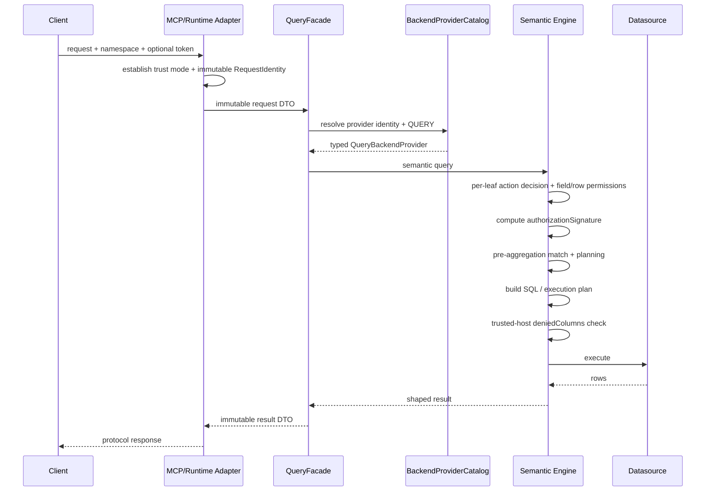

# 系统总览

## 1. 系统定位

Foggy Data MCP Bridge 把数据源、TM/QM 语义模型和查询引擎组合为可被 AI、MCP 客户端与
应用系统调用的语义数据服务。系统负责：

- 管理数据源、namespace、Bundle 与模型生命周期；
- 把稳定 DTO 查询或 MCP 工具调用转换为语义查询；
- 完成权限校验、SQL/执行计划生成、查询执行与结果整形；
- 通过小型 SPI 接入 backend、缓存和其他可选能力；
- 以可执行 Spring Boot launcher 或嵌入式模块方式交付。

它不替代客户的身份认证系统，但支持两种不同的权限接入方式：

- Runtime API 直连时，调用方只提交业务查询和可选的 opaque token；Runtime 建立非空匿名或
  opaque-subject identity，由 TM/QM 作者使用平台提供的 `get/post` 或其他作者代码按
  action/resource 决定模型、字段和行权限；
- 可信宿主接入时，宿主可以完成外部业务授权，并通过内部引擎契约传入
  `fieldAccess`、`deniedColumns`、`systemSlice` 等治理上下文。

TM/QM 未声明权限时，该模型是作者明确发布的开放模型，无 token 也允许访问。声明权限解析器后，
空 token 仍会进入解析器，是否允许匿名由作者决定；解析失败或返回非法决策时对该模型 fail closed。

Runtime API 的 auth code 是管理接口保护层，不等同于某次数据查询的业务身份，也不能隐式绕过
QM 权限。当前 Runtime Query 入口只传递 namespace，opaque token 和模型权限决策链路尚未完整
接通。详细边界见
[Runtime 内生权限与预聚合](runtime-permissions-and-preaggregation.md)。

## 2. 逻辑分层

| 层 | 主要模块 | 职责 |
|---|---|---|
| 接入与装配 | `foggy-mcp-launcher` | 可执行 JAR、Spring Boot 装配、交付边界 |
| MCP 接入 | `foggy-dataset-mcp`, `foggy-mcp-spi` | JSON-RPC/SSE、工具发现与调度、审计、面向角色的工具面 |
| Runtime 管理 | `foggy-runtime-api` | 数据源、namespace、Bundle、资源、模型、查询与 compose 管理 API |
| 稳定模型契约 | `foggy-dataset-model-api` | QueryFacade/DTO、backend identity/capability/port |
| provider 治理 | `foggy-dataset-model-core`, `-starter`, `-web`, `-tck` | catalog、自动装配、诊断、契约测试 |
| 语义引擎 | `foggy-dataset-model-engine` | TM/QM 加载、语义规划、权限、compose、pivot、刷新与执行 |
| 数据与脚本 | `foggy-dataset`, `foggy-fsscript` | JDBC 方言/执行基础、TM/QM 脚本解析 |
| 可选扩展 | `addons/*`, memory-grid 模块 | Mongo、cache、vector、preagg、GraphQL、viewer、Odoo 等 |

接入层只能通过稳定契约或明确的 engine 内部边界调用模型能力，不应新建
`loader + model.query()` 旁路。

## 3. 部署形态

### 3.1 独立 launcher

`foggy-mcp-launcher` 组装 MCP、Runtime API、语义引擎、示例资源及选配 addon，产出可执行
Spring Boot JAR。外部客户端通过 HTTP/MCP 调用，数据访问由运行时管理的数据源完成。

### 3.2 嵌入式 Spring Boot

宿主应用可以按需依赖 model API、engine、Runtime API 或 MCP 模块，并由 Spring
auto-configuration 装配。嵌入式方式仍必须遵守相同的 namespace、provider catalog、
模型发布和权限边界，不能因为同进程部署而绕开这些契约。

### 3.3 外部/可选 backend

Mongo、vector、pre-aggregation、cache、memory-grid 及远程 dataset client 以独立模块接入。
模块存在不等于它已经声明 Model SPI v2 capability；只有实际实现对应 port 并通过契约验证的
provider 才能发布 capability。

## 4. 对外接口面

### MCP

- `/mcp/analyst/rpc`、`/mcp/analyst/stream`
- `/mcp/admin/rpc`、`/mcp/admin/stream`
- `/mcp/business/rpc`、`/mcp/business/stream`

角色端点决定可发现和可执行的工具集合。MCP controller 负责协议适配和上下文建立，查询语义
由下层服务与 QueryFacade/engine 完成。

### Runtime API

统一前缀为 `/api/v1`，覆盖：

- capabilities；
- datasources 与 namespace-datasource binding；
- bundles 与 resources；
- models 的 list/describe/validate/refresh；
- query validate/execute；
- tables inspect、受控 SQL query；
- compose validate/preview/execute；
- 作者/管理面的 FSScript execute。

Runtime API 使用自身的稳定 envelope 与错误码，不应机械套用其他 controller 的 `RX` 返回约定。

### 健康与辅助接口

MCP 模块暴露 `/healthz`、`/readyz` 和 `/info`。开发、图表及兼容接口属于辅助面，不能被当作
稳定 Model SPI。

## 5. 主查询流

任一 identity、capability、namespace、模型或已声明的权限前置条件无法确定时，应拒绝请求而
不是猜测或回退到权限更宽的路径。未声明权限的开放 QM 不以存在 token 或外部身份为前置条件。

## 6. 信任与安全边界

- 不在仓库、配置示例、测试收据或日志中提交真实 key、密码和 token。
- Runtime auth code 保护管理接口，但不替代客户 IAM。
- namespace 必须由可信接入层确定并贯穿请求；不能由不可信模型内容提升或跨越。
- Runtime API 请求体和用户 DSL 不能携带 `fieldAccess`、`deniedColumns`、`systemSlice`
  或其他用于构造自身权限边界的治理参数。
- 能够直接接受上述治理参数的 engine-native、兼容或测试接口属于内部接口，不能作为公开
  Runtime API 部署。
- 可信宿主模式下，`fieldAccess` 控制可引用的语义字段，`deniedColumns` 在物理计划形成后
  检查实际表列，`systemSlice` 注入宿主已经裁决的系统行条件。
- Runtime API 直连模式下，Header token 是可选 opaque 输入；无 Header 时建立匿名 identity。
  无权限声明的 QM 是开放模型，有权限声明的模型由作者通过平台 `get/post` 或其他受信模型代码
  按 action/resource 求值；管理 principal 不构成数据面绕过。
- 公共 CLI 分别承载管理 `X-Foggy-Runtime-Code` 与可选数据面 `Authorization`，不得用一个参数
  或 Header 同时表达模型发布权限和业务查询身份；旧命令不传数据身份时保持匿名兼容。
- `get/post` 是已发布 TM/QM 的作者能力，不是 Runtime 查询调用方可以通过 DSL、Compose 或 CTE
  动态执行的网络能力。
- 使用完整 evaluator 的 `/api/v1/fsscript/execute` 与模型发布同属作者/管理面，必须要求管理
  凭据；普通数据面如需脚本表达式，只能使用排除 `get/post` 和 Bean import 的受限 evaluator。
- 受保护模型的权限函数失败、超时或返回非法决策时不得回退到公开模型语义；但不能因为全局
  缺少 token 就拒绝一个未声明权限的开放模型。
- 模型 list/describe/validate query/execute query/member query 必须执行对应动作权限判断，
  不能通过直接指定模型名绕过 catalog 可见性；成员查询和缓存还必须应用字段、行权限与授权签名。
- 行权限必须在每个叶子 scan 和预聚合匹配前形成。预聚合无法保留权限字段或等价重建权限谓词时，
  只能跳过该候选并回源；不能使用某个用户权限快照构建后作为全局预聚合共享。
- provider discovery、capability 解析、Bundle 冲突检查和模型 admission 均 fail closed。
- diagnostics 只暴露运行所需的只读状态，不泄露连接凭据或敏感模型内容。

Namespace 与 Bundle 的接口细节见
[Bundle & Namespace 开发说明](../dev-guide/bundle-namespace.md)。
