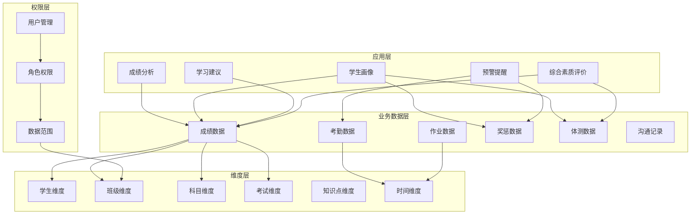
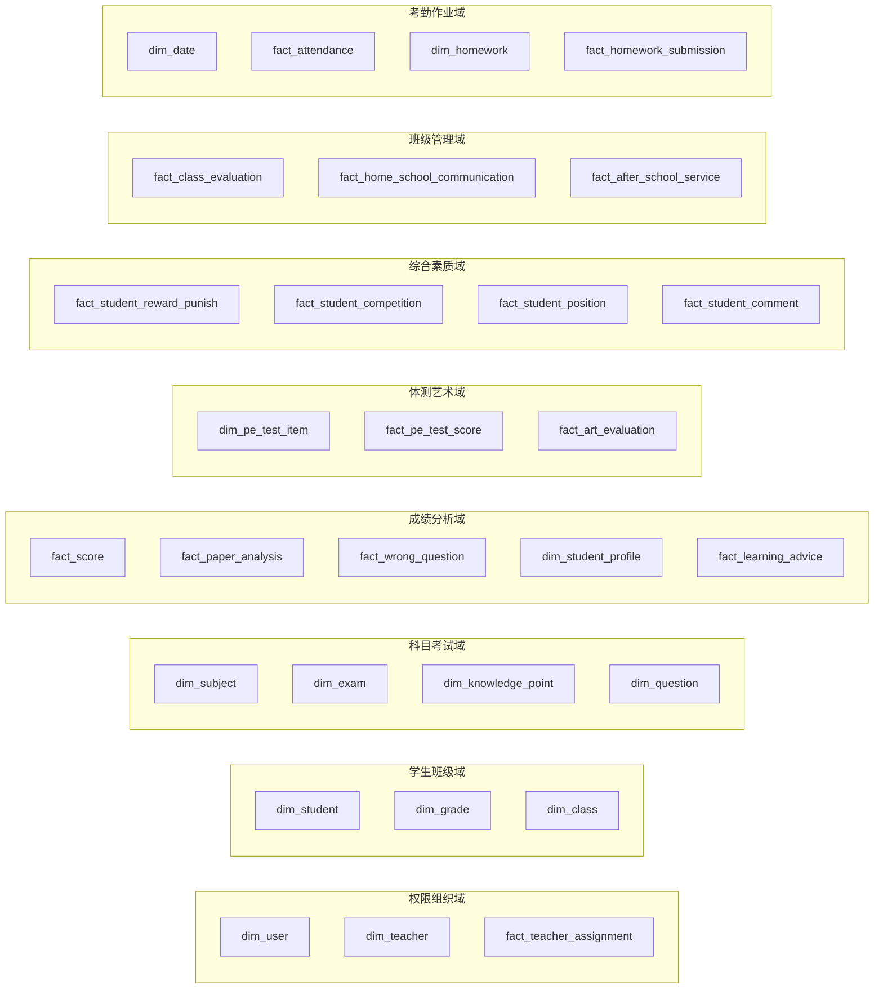
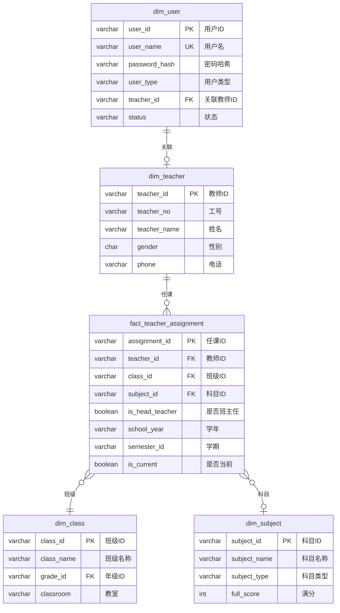
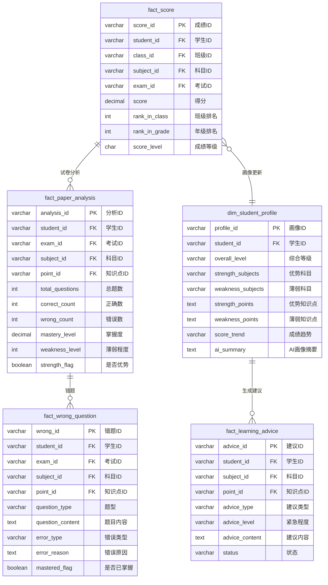
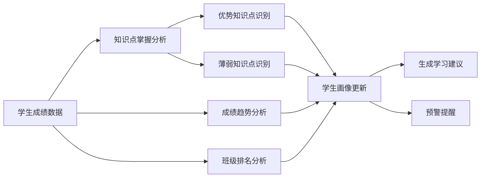
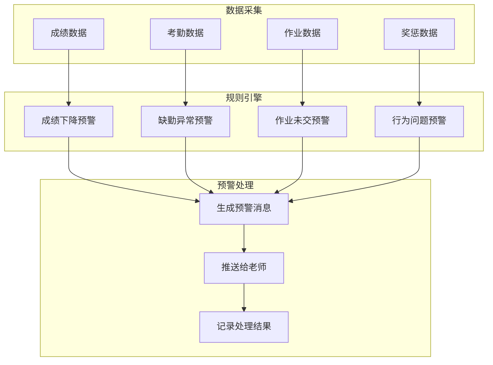
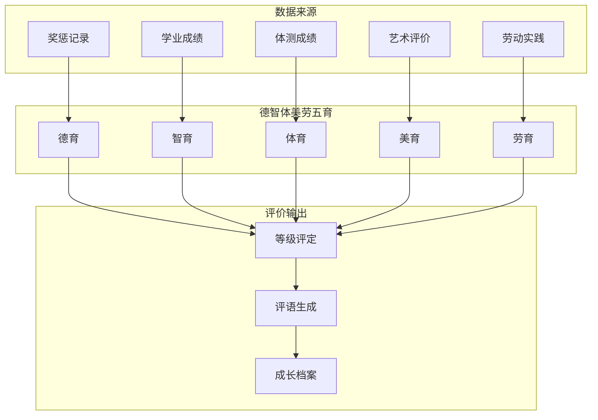

# 学生数据分析系统 - 数据模型设计文档

## 1. 概述

### 1.1 设计目标

本数据模型旨在为中小学教育场景提供一套完整的数据分析解决方案，核心目标是：

```
┌─────────────────────────────────────────────────────────────────────────────┐
│                              核心目标                                        │
├─────────────────────────────────────────────────────────────────────────────┤
│                                                                             │
│  🎯 协助老师完成对学生的个性化教育                                            │
│      ├── 精准识别学生长短板                                                  │
│      ├── 智能生成学习建议                                                    │
│      └── 追踪学生成长轨迹                                                    │
│                                                                             │
│  👀 让老师和家长及时掌握学生的教育情况                                         │
│      ├── 多维度学生画像                                                      │
│      ├── 实时成绩动态                                                        │
│      └── 综合素质发展                                                        │
│                                                                             │
│  ⚠️ 及时发现问题，并采用合适的方案                                            │
│      ├── 成绩异常预警                                                        │
│      ├── 考勤异常提醒                                                        │
│      └── 行为问题追踪                                                        │
│                                                                             │
└─────────────────────────────────────────────────────────────────────────────┘
```

### 1.2 目标用户

| 用户角色 | 核心需求 | 使用场景 |
|---------|---------|---------|
| **班主任** | 全面了解班级学生 | 班级管理、家长沟通、期末评语 |
| **学科老师** | 本科成绩分析 | 教学评估、知识点掌握分析 |
| **学校管理** | 全校数据概览 | 教学质量监控、决策支持 |

### 1.3 系统特点

- **AI驱动**：支持自然语言查询，降低使用门槛
- **多维度分析**：成绩、考勤、行为、综合素质全方位覆盖
- **个性化建议**：基于数据自动生成学习建议
- **预警机制**：及时发现异常情况并提醒

---

## 2. 整体架构

### 2.1 数据模型分层架构



### 2.2 数据域划分



---

## 3. ER图

### 3.1 核心实体关系图

```mermaid
erDiagram
    dim_user ||--o| dim_teacher : "关联"
    dim_teacher ||--o{ fact_teacher_assignment : "任课"
    fact_teacher_assignment }o--|| dim_class : "任教班级"
    fact_teacher_assignment }o--o| dim_subject : "任教科目"
    
    dim_class }o--|| dim_grade : "所属年级"
    dim_student }o--|| dim_class : "所属班级"
    
    fact_score }o--|| dim_student : "学生"
    fact_score }o--|| dim_class : "班级"
    fact_score }o--|| dim_subject : "科目"
    fact_score }o--|| dim_exam : "考试"
    
    fact_paper_analysis }o--|| dim_student : "学生"
    fact_paper_analysis }o--|| dim_exam : "考试"
    fact_paper_analysis }o--|| dim_subject : "科目"
    fact_paper_analysis }o--|| dim_knowledge_point : "知识点"
    
    fact_wrong_question }o--|| dim_student : "学生"
    fact_wrong_question }o--|| dim_subject : "科目"
    fact_wrong_question }o--o| dim_knowledge_point : "知识点"
    
    dim_student_profile ||--|| dim_student : "画像"
    
    fact_learning_advice }o--|| dim_student : "学生"
    fact_learning_advice }o--o| dim_subject : "科目"
    fact_learning_advice }o--o| dim_knowledge_point : "知识点"
    
    fact_attendance }o--|| dim_student : "学生"
    fact_attendance }o--|| dim_class : "班级"
    fact_attendance }o--|| dim_date : "日期"
    
    dim_homework }o--|| dim_subject : "科目"
    dim_homework }o--|| dim_class : "班级"
    fact_homework_submission }o--|| dim_homework : "作业"
    fact_homework_submission }o--|| dim_student : "学生"
    
    fact_pe_test_score }o--|| dim_student : "学生"
    fact_pe_test_score }o--|| dim_pe_test_item : "体测项目"
    
    fact_student_reward_punish }o--|| dim_student : "学生"
    fact_student_reward_punish }o--|| dim_class : "班级"
    
    fact_student_competition }o--|| dim_student : "学生"
    fact_student_competition }o--|| dim_class : "班级"
    
    fact_student_position }o--|| dim_student : "学生"
    fact_student_position }o--|| dim_class : "班级"
    
    fact_student_comment }o--|| dim_student : "学生"
    fact_student_comment }o--|| dim_class : "班级"
    
    fact_class_evaluation }o--|| dim_class : "班级"
    
    fact_home_school_communication }o--|| dim_student : "学生"
    fact_home_school_communication }o--|| dim_teacher : "老师"
    
    fact_after_school_service }o--|| dim_student : "学生"
    fact_after_school_service }o--|| dim_date : "日期"
```



### 3.2 权限模型关系图



### 3.3 成绩分析域关系图



### 3.4 综合素质域关系图

```mermaid
erDiagram
    fact_student_reward_punish {
        varchar record_id PK "记录ID"
        varchar student_id FK "学生ID"
        varchar class_id FK "班级ID"
        varchar type "类型"
        varchar category "分类"
        varchar title "事由"
        text description "详细说明"
        varchar level "级别"
        date occur_date "发生日期"
    }
    
    fact_student_competition {
        varchar competition_id PK "竞赛ID"
        varchar student_id FK "学生ID"
        varchar class_id FK "班级ID"
        varchar competition_name "竞赛名称"
        varchar competition_level "竞赛级别"
        varchar competition_type "竞赛类型"
        date competition_date "竞赛日期"
        varchar award_level "获奖等级"
        varchar certificate_no "证书编号"
    }
    
    fact_student_position {
        varchar position_id PK "职务ID"
        varchar student_id FK "学生ID"
        varchar class_id FK "班级ID"
        varchar position_name "职务名称"
        varchar position_type "职务类型"
        date start_date "开始日期"
        date end_date "结束日期"
        boolean is_current "是否当前"
    }
    
    fact_student_comment {
        varchar comment_id PK "评语ID"
        varchar student_id FK "学生ID"
        varchar class_id FK "班级ID"
        varchar semester_id FK "学期ID"
        text moral_comment "德育评语"
        text intellectual_comment "智育评语"
        text physical_comment "体育评语"
        text aesthetic_comment "美育评语"
        text labor_comment "劳育评语"
        text overall_comment "综合评语"
        boolean ai_generated "AI生成"
    }
    
    fact_class_evaluation {
        varchar eval_id PK "评比ID"
        varchar class_id FK "班级ID"
        varchar eval_type "评比类型"
        varchar eval_period "评比周期"
        date eval_date "评比日期"
        varchar result "结果"
        decimal score "评分"
    }
    
    fact_home_school_communication {
        varchar comm_id PK "沟通ID"
        varchar student_id FK "学生ID"
        varchar teacher_id FK "教师ID"
        varchar comm_type "沟通方式"
        date comm_date "沟通日期"
        varchar topic "主题"
        text content "内容"
        text result "结果"
    }
```



---

## 4. 数据表详细设计

### 4.1 权限组织域

#### 4.1.1 用户表 (dim_user)

| 字段名 | 类型 | 必填 | 说明 |
|--------|------|------|------|
| user_id | VARCHAR(32) | 是 | 用户ID，主键 |
| user_name | VARCHAR(50) | 是 | 用户名，唯一 |
| password_hash | VARCHAR(200) | 是 | 密码哈希 |
| user_type | VARCHAR(20) | 是 | 用户类型：admin/teacher |
| teacher_id | VARCHAR(32) | 否 | 关联教师ID |
| status | VARCHAR(20) | 是 | 状态：active/inactive |
| last_login_at | TIMESTAMP | 否 | 最后登录时间 |
| created_at | TIMESTAMP | 是 | 创建时间 |

#### 4.1.2 教师表 (dim_teacher)

| 字段名 | 类型 | 必填 | 说明 |
|--------|------|------|------|
| teacher_id | VARCHAR(32) | 是 | 教师ID，主键 |
| teacher_no | VARCHAR(20) | 否 | 工号 |
| teacher_name | VARCHAR(50) | 是 | 姓名 |
| gender | CHAR(1) | 否 | 性别：M/F |
| phone | VARCHAR(20) | 否 | 联系电话 |
| created_at | TIMESTAMP | 是 | 创建时间 |

#### 4.1.3 教师任课关系表 (fact_teacher_assignment)

| 字段名 | 类型 | 必填 | 说明 |
|--------|------|------|------|
| assignment_id | VARCHAR(32) | 是 | 任课ID，主键 |
| teacher_id | VARCHAR(32) | 是 | 教师ID |
| class_id | VARCHAR(32) | 是 | 班级ID |
| subject_id | VARCHAR(32) | 否 | 科目ID（班主任可为空） |
| is_head_teacher | BOOLEAN | 是 | 是否班主任 |
| school_year | VARCHAR(20) | 是 | 学年 |
| semester_id | VARCHAR(32) | 否 | 学期ID |
| is_current | BOOLEAN | 是 | 是否当前 |
| created_at | TIMESTAMP | 是 | 创建时间 |

---

### 4.2 学生班级域

#### 4.2.1 学生表 (dim_student)

| 字段名 | 类型 | 必填 | 说明 |
|--------|------|------|------|
| student_id | VARCHAR(32) | 是 | 学生ID，主键 |
| student_no | VARCHAR(20) | 否 | 学号 |
| student_name | VARCHAR(50) | 是 | 姓名 |
| gender | CHAR(1) | 否 | 性别：M/F |
| birth_date | DATE | 否 | 出生日期 |
| class_id | VARCHAR(32) | 是 | 所属班级ID |
| enroll_date | DATE | 否 | 入学日期 |
| address | VARCHAR(200) | 否 | 家庭住址 |
| phone | VARCHAR(20) | 否 | 联系电话 |
| student_status | VARCHAR(20) | 是 | 状态：active/graduated/transferred |
| admission_type | VARCHAR(20) | 否 | 入学类型：normal/transfer |
| political_status | VARCHAR(20) | 否 | 政治面貌：少先队员/共青团员 |
| boarding_status | VARCHAR(20) | 否 | 住宿状态：day_student/boarding |
| created_at | TIMESTAMP | 是 | 创建时间 |

#### 4.2.2 年级表 (dim_grade)

| 字段名 | 类型 | 必填 | 说明 |
|--------|------|------|------|
| grade_id | VARCHAR(32) | 是 | 年级ID，主键 |
| grade_name | VARCHAR(50) | 是 | 年级名称 |
| grade_level | INT | 否 | 年级序号：1-6小学，7-9初中 |
| stage | VARCHAR(20) | 是 | 学段：primary/junior |
| created_at | TIMESTAMP | 是 | 创建时间 |

#### 4.2.3 班级表 (dim_class)

| 字段名 | 类型 | 必填 | 说明 |
|--------|------|------|------|
| class_id | VARCHAR(32) | 是 | 班级ID，主键 |
| class_name | VARCHAR(50) | 是 | 班级名称 |
| grade_id | VARCHAR(32) | 是 | 年级ID |
| classroom | VARCHAR(50) | 否 | 教室 |
| class_type | VARCHAR(20) | 否 | 班级类型：regular/key/special |
| student_count | INT | 否 | 班级人数 |
| created_at | TIMESTAMP | 是 | 创建时间 |

---

### 4.3 科目考试域

#### 4.3.1 科目表 (dim_subject)

| 字段名 | 类型 | 必填 | 说明 |
|--------|------|------|------|
| subject_id | VARCHAR(32) | 是 | 科目ID，主键 |
| subject_name | VARCHAR(50) | 是 | 科目名称 |
| subject_type | VARCHAR(20) | 是 | 科目类型：main/minor |
| full_score | INT | 是 | 满分，默认100 |
| pass_score | INT | 是 | 及格分，默认60 |
| excellent_score | INT | 是 | 优秀分，默认85 |
| is_exam_subject | BOOLEAN | 是 | 是否考试科目 |
| weight | DECIMAL(3,2) | 否 | 科目权重 |
| sort_order | INT | 否 | 排序 |
| created_at | TIMESTAMP | 是 | 创建时间 |

#### 4.3.2 考试表 (dim_exam)

| 字段名 | 类型 | 必填 | 说明 |
|--------|------|------|------|
| exam_id | VARCHAR(32) | 是 | 考试ID，主键 |
| exam_name | VARCHAR(100) | 是 | 考试名称 |
| exam_type | VARCHAR(20) | 是 | 考试类型：daily/unit/midterm/final |
| exam_date | DATE | 是 | 考试日期 |
| school_year | VARCHAR(20) | 是 | 学年 |
| semester_id | VARCHAR(32) | 是 | 学期ID |
| semester_name | VARCHAR(50) | 否 | 学期名称 |
| created_at | TIMESTAMP | 是 | 创建时间 |

#### 4.3.3 知识点表 (dim_knowledge_point)

| 字段名 | 类型 | 必填 | 说明 |
|--------|------|------|------|
| point_id | VARCHAR(32) | 是 | 知识点ID，主键 |
| point_code | VARCHAR(50) | 否 | 知识点编码 |
| point_name | VARCHAR(100) | 是 | 知识点名称 |
| subject_id | VARCHAR(32) | 是 | 所属科目ID |
| grade_id | VARCHAR(32) | 否 | 适用年级ID |
| parent_id | VARCHAR(32) | 否 | 父知识点ID |
| point_level | INT | 否 | 层级深度 |
| difficulty | INT | 否 | 难度等级 1-5 |
| importance | INT | 否 | 重要程度 1-5 |
| description | TEXT | 否 | 知识点描述 |
| created_at | TIMESTAMP | 是 | 创建时间 |

#### 4.3.4 知识点闭包表 (knowledge_point_closure)

| 字段名 | 类型 | 必填 | 说明 |
|--------|------|------|------|
| parent_id | VARCHAR(32) | 是 | 祖先节点ID，联合主键 |
| point_id | VARCHAR(32) | 是 | 后代节点ID，联合主键 |
| distance | INT | 是 | 层级距离，0表示自身 |

#### 4.3.5 题库表 (dim_question)

| 字段名 | 类型 | 必填 | 说明 |
|--------|------|------|------|
| question_id | VARCHAR(32) | 是 | 题目ID，主键 |
| subject_id | VARCHAR(32) | 是 | 科目ID |
| point_id | VARCHAR(32) | 否 | 知识点ID |
| question_type | VARCHAR(50) | 是 | 题型：choice/fill/answer |
| question_content | TEXT | 是 | 题目内容 |
| question_image | VARCHAR(500) | 否 | 题目图片URL |
| correct_answer | TEXT | 是 | 正确答案 |
| analysis | TEXT | 否 | 解析说明 |
| difficulty | INT | 否 | 难度 1-5 |
| embedding | VECTOR(1536) | 否 | 语义向量（二期） |
| source_type | VARCHAR(50) | 否 | 来源类型 |
| source_id | VARCHAR(32) | 否 | 来源ID |
| created_at | TIMESTAMP | 是 | 创建时间 |

---

### 4.4 成绩分析域

#### 4.4.1 成绩事实表 (fact_score)

| 字段名 | 类型 | 必填 | 说明 |
|--------|------|------|------|
| score_id | VARCHAR(32) | 是 | 成绩ID，主键 |
| student_id | VARCHAR(32) | 是 | 学生ID |
| class_id | VARCHAR(32) | 是 | 班级ID |
| subject_id | VARCHAR(32) | 是 | 科目ID |
| exam_id | VARCHAR(32) | 是 | 考试ID |
| score | DECIMAL(5,2) | 是 | 得分 |
| rank_in_class | INT | 否 | 班级排名 |
| rank_in_grade | INT | 否 | 年级排名 |
| score_level | CHAR(1) | 否 | 成绩等级：A/B/C/D |
| score_type | VARCHAR(20) | 否 | 成绩类型：written/pe_test/art_eval |
| created_at | TIMESTAMP | 是 | 创建时间 |

#### 4.4.2 试卷分析表 (fact_paper_analysis)

| 字段名 | 类型 | 必填 | 说明 |
|--------|------|------|------|
| analysis_id | VARCHAR(32) | 是 | 分析ID，主键 |
| student_id | VARCHAR(32) | 是 | 学生ID |
| exam_id | VARCHAR(32) | 是 | 考试ID |
| subject_id | VARCHAR(32) | 是 | 科目ID |
| point_id | VARCHAR(32) | 是 | 知识点ID |
| total_questions | INT | 是 | 该知识点总题数 |
| correct_count | INT | 是 | 正确题数 |
| wrong_count | INT | 是 | 错误题数 |
| score_earned | DECIMAL(5,2) | 否 | 实际得分 |
| score_total | DECIMAL(5,2) | 否 | 该知识点总分 |
| mastery_level | DECIMAL(5,2) | 否 | 掌握度 0-100 |
| mastery_grade | VARCHAR(10) | 否 | 掌握等级：A/B/C/D |
| weakness_level | INT | 否 | 薄弱程度 1-5 |
| strength_flag | BOOLEAN | 否 | 是否为优势点 |
| ai_analysis | TEXT | 否 | AI分析说明 |
| created_at | TIMESTAMP | 是 | 创建时间 |

#### 4.4.3 错题记录表 (fact_wrong_question)

| 字段名 | 类型 | 必填 | 说明 |
|--------|------|------|------|
| wrong_id | VARCHAR(32) | 是 | 错题ID，主键 |
| student_id | VARCHAR(32) | 是 | 学生ID |
| exam_id | VARCHAR(32) | 否 | 考试ID |
| subject_id | VARCHAR(32) | 是 | 科目ID |
| point_id | VARCHAR(32) | 否 | 知识点ID |
| question_type | VARCHAR(50) | 否 | 题型 |
| question_content | TEXT | 否 | 题目内容 |
| question_image | VARCHAR(500) | 否 | 题目图片URL |
| student_answer | TEXT | 否 | 学生答案 |
| correct_answer | TEXT | 否 | 正确答案 |
| score_earned | DECIMAL(5,2) | 否 | 实际得分 |
| score_total | DECIMAL(5,2) | 否 | 题目总分 |
| error_type | VARCHAR(50) | 否 | 错误类型：计算/概念/审题 |
| error_reason | TEXT | 否 | AI分析的错误原因 |
| difficulty | INT | 否 | 题目难度 |
| review_status | VARCHAR(20) | 否 | 复习状态：pending/reviewed/mastered |
| review_count | INT | 否 | 复习次数 |
| mastered_flag | BOOLEAN | 否 | 是否已掌握 |
| created_at | TIMESTAMP | 是 | 创建时间 |
| reviewed_at | TIMESTAMP | 否 | 最后复习时间 |

#### 4.4.4 学生能力画像表 (dim_student_profile)

| 字段名 | 类型 | 必填 | 说明 |
|--------|------|------|------|
| profile_id | VARCHAR(32) | 是 | 画像ID，主键 |
| student_id | VARCHAR(32) | 是 | 学生ID，唯一 |
| overall_level | VARCHAR(10) | 否 | 综合等级：A/B/C/D |
| learning_style | VARCHAR(50) | 否 | 学习风格（AI分析） |
| strength_subjects | VARCHAR(500) | 否 | 优势科目JSON数组 |
| weakness_subjects | VARCHAR(500) | 否 | 薄弱科目JSON数组 |
| strength_points | TEXT | 否 | 优势知识点JSON |
| weakness_points | TEXT | 否 | 薄弱知识点JSON |
| study_habits | TEXT | 否 | 学习习惯分析 |
| score_trend | VARCHAR(20) | 否 | 成绩趋势：rising/stable/declining |
| effort_level | VARCHAR(20) | 否 | 努力程度评估 |
| ai_summary | TEXT | 否 | AI生成的学生画像摘要 |
| last_analyzed_at | TIMESTAMP | 否 | 最后分析时间 |
| updated_at | TIMESTAMP | 是 | 更新时间 |

#### 4.4.5 学习建议表 (fact_learning_advice)

| 字段名 | 类型 | 必填 | 说明 |
|--------|------|------|------|
| advice_id | VARCHAR(32) | 是 | 建议ID，主键 |
| student_id | VARCHAR(32) | 是 | 学生ID |
| subject_id | VARCHAR(32) | 否 | 科目ID |
| point_id | VARCHAR(32) | 否 | 知识点ID |
| advice_type | VARCHAR(50) | 是 | 建议类型：review/practice/consolidate/extend |
| advice_level | VARCHAR(20) | 是 | 紧急程度：high/medium/low |
| advice_content | TEXT | 是 | 建议内容 |
| recommended_resources | TEXT | 否 | 推荐学习资源JSON |
| generate_type | VARCHAR(20) | 否 | 生成方式：ai/rule |
| based_on | TEXT | 否 | 基于什么数据生成 |
| status | VARCHAR(20) | 是 | 状态：pending/done/ignored |
| feedback | VARCHAR(500) | 否 | 老师反馈 |
| created_at | TIMESTAMP | 是 | 创建时间 |
| expires_at | TIMESTAMP | 否 | 建议有效期 |

---

### 4.5 体测艺术域

#### 4.5.1 体测项目维度表 (dim_pe_test_item)

| 字段名 | 类型 | 必填 | 说明 |
|--------|------|------|------|
| item_id | VARCHAR(32) | 是 | 项目ID，主键 |
| item_code | VARCHAR(50) | 否 | 项目编码 |
| item_name | VARCHAR(100) | 是 | 项目名称 |
| category | VARCHAR(50) | 是 | 分类：body_shape/body_function/physical_quality |
| category_name | VARCHAR(50) | 是 | 分类名称 |
| unit | VARCHAR(20) | 否 | 计量单位：cm/kg/ml/秒/次 |
| score_type | VARCHAR(20) | 否 | 评分类型：higher_better/lower_better |
| gender | VARCHAR(10) | 否 | 适用性别：M/F/ALL |
| grade_range | VARCHAR(50) | 否 | 适用年级范围 |
| excellent_standard | VARCHAR(100) | 否 | 优秀标准 |
| pass_standard | VARCHAR(100) | 否 | 及格标准 |
| sort_order | INT | 否 | 排序 |
| created_at | TIMESTAMP | 是 | 创建时间 |

#### 4.5.2 体测成绩事实表 (fact_pe_test_score)

| 字段名 | 类型 | 必填 | 说明 |
|--------|------|------|------|
| score_id | VARCHAR(32) | 是 | 成绩ID，主键 |
| student_id | VARCHAR(32) | 是 | 学生ID |
| class_id | VARCHAR(32) | 是 | 班级ID |
| item_id | VARCHAR(32) | 是 | 体测项目ID |
| test_date | DATE | 是 | 测试日期 |
| semester_id | VARCHAR(32) | 是 | 学期ID |
| school_year | VARCHAR(20) | 是 | 学年 |
| test_value | DECIMAL(10,2) | 是 | 原始成绩值 |
| score | DECIMAL(5,2) | 否 | 百分制得分 |
| grade | VARCHAR(10) | 否 | 等级：优秀/良好/及格/不及格 |
| rank_in_class | INT | 否 | 班级排名 |
| rank_in_grade | INT | 否 | 年级排名 |
| bmi_value | DECIMAL(4,1) | 否 | BMI值 |
| bmi_level | VARCHAR(20) | 否 | 营养状况：正常/超重/肥胖/营养不良 |
| total_score | DECIMAL(5,2) | 否 | 体测总分 |
| total_grade | VARCHAR(10) | 否 | 体测总评等级 |
| created_at | TIMESTAMP | 是 | 创建时间 |

#### 4.5.3 艺术技能评价表 (fact_art_evaluation)

| 字段名 | 类型 | 必填 | 说明 |
|--------|------|------|------|
| eval_id | VARCHAR(32) | 是 | 评价ID，主键 |
| student_id | VARCHAR(32) | 是 | 学生ID |
| class_id | VARCHAR(32) | 是 | 班级ID |
| subject_id | VARCHAR(32) | 是 | 科目ID（美术/音乐） |
| eval_date | DATE | 是 | 评价日期 |
| semester_id | VARCHAR(32) | 是 | 学期ID |
| school_year | VARCHAR(20) | 是 | 学年 |
| eval_type | VARCHAR(50) | 是 | 评价类型：work/skill/performance |
| eval_item | VARCHAR(100) | 否 | 评价项目 |
| score | DECIMAL(5,2) | 否 | 得分 |
| grade | VARCHAR(10) | 否 | 等级：A/B/C/D |
| creativity_score | INT | 否 | 创意分 |
| technique_score | INT | 否 | 技法分 |
| expression_score | INT | 否 | 表现力分 |
| work_image | VARCHAR(500) | 否 | 作品图片URL |
| work_video | VARCHAR(500) | 否 | 表演视频URL |
| teacher_comment | TEXT | 否 | 教师评语 |
| created_at | TIMESTAMP | 是 | 创建时间 |

---

### 4.6 综合素质域

#### 4.6.1 学生奖惩记录表 (fact_student_reward_punish)

| 字段名 | 类型 | 必填 | 说明 |
|--------|------|------|------|
| record_id | VARCHAR(32) | 是 | 记录ID，主键 |
| student_id | VARCHAR(32) | 是 | 学生ID |
| class_id | VARCHAR(32) | 是 | 班级ID |
| type | VARCHAR(20) | 是 | 类型：reward/punish |
| category | VARCHAR(50) | 否 | 分类：学习/品德/纪律/劳动/体育 |
| title | VARCHAR(200) | 是 | 奖惩事由 |
| description | TEXT | 否 | 详细说明 |
| level | VARCHAR(20) | 否 | 级别：校级/年级/班级 |
| occur_date | DATE | 是 | 发生日期 |
| semester_id | VARCHAR(32) | 否 | 学期ID |
| handler_id | VARCHAR(32) | 否 | 处理老师ID |
| result | VARCHAR(200) | 否 | 处理结果 |
| attachment | VARCHAR(500) | 否 | 证明材料URL |
| created_at | TIMESTAMP | 是 | 创建时间 |

#### 4.6.2 学生竞赛获奖表 (fact_student_competition)

| 字段名 | 类型 | 必填 | 说明 |
|--------|------|------|------|
| competition_id | VARCHAR(32) | 是 | 竞赛ID，主键 |
| student_id | VARCHAR(32) | 是 | 学生ID |
| class_id | VARCHAR(32) | 是 | 班级ID |
| competition_name | VARCHAR(200) | 是 | 竞赛名称 |
| competition_level | VARCHAR(50) | 否 | 竞赛级别：国家级/省级/市级/区级/校级 |
| competition_type | VARCHAR(50) | 否 | 竞赛类型：学科/体育/艺术/科技 |
| competition_date | DATE | 否 | 竞赛日期 |
| award_level | VARCHAR(50) | 否 | 获奖等级：一等奖/二等奖/三等奖 |
| award_rank | VARCHAR(50) | 否 | 排名 |
| certificate_no | VARCHAR(100) | 否 | 证书编号 |
| certificate_image | VARCHAR(500) | 否 | 证书图片URL |
| coach_id | VARCHAR(32) | 否 | 指导老师ID |
| created_at | TIMESTAMP | 是 | 创建时间 |

#### 4.6.3 班干部职务表 (fact_student_position)

| 字段名 | 类型 | 必填 | 说明 |
|--------|------|------|------|
| position_id | VARCHAR(32) | 是 | 职务ID，主键 |
| student_id | VARCHAR(32) | 是 | 学生ID |
| class_id | VARCHAR(32) | 是 | 班级ID |
| position_name | VARCHAR(50) | 是 | 职务名称 |
| position_type | VARCHAR(20) | 否 | 职务类型：class_committee/course_rep/group_leader |
| start_date | DATE | 否 | 开始日期 |
| end_date | DATE | 否 | 结束日期 |
| is_current | BOOLEAN | 是 | 是否当前 |
| semester_id | VARCHAR(32) | 否 | 学期ID |
| created_at | TIMESTAMP | 是 | 创建时间 |

#### 4.6.4 学生评语表 (fact_student_comment)

| 字段名 | 类型 | 必填 | 说明 |
|--------|------|------|------|
| comment_id | VARCHAR(32) | 是 | 评语ID，主键 |
| student_id | VARCHAR(32) | 是 | 学生ID |
| class_id | VARCHAR(32) | 是 | 班级ID |
| semester_id | VARCHAR(32) | 是 | 学期ID |
| school_year | VARCHAR(20) | 是 | 学年 |
| comment_type | VARCHAR(50) | 是 | 评语类型：期末评语/综合素质评价/日常评语 |
| moral_comment | TEXT | 否 | 德育评语 |
| intellectual_comment | TEXT | 否 | 智育评语 |
| physical_comment | TEXT | 否 | 体育评语 |
| aesthetic_comment | TEXT | 否 | 美育评语 |
| labor_comment | TEXT | 否 | 劳育评语 |
| overall_comment | TEXT | 否 | 综合评语 |
| moral_grade | VARCHAR(10) | 否 | 德育等级 |
| intellectual_grade | VARCHAR(10) | 否 | 智育等级 |
| physical_grade | VARCHAR(10) | 否 | 体育等级 |
| aesthetic_grade | VARCHAR(10) | 否 | 美育等级 |
| labor_grade | VARCHAR(10) | 否 | 劳育等级 |
| ai_generated | BOOLEAN | 否 | AI生成标记 |
| writer_id | VARCHAR(32) | 否 | 撰写人ID |
| created_at | TIMESTAMP | 是 | 创建时间 |

---

### 4.7 班级管理域

#### 4.7.1 班级评比记录表 (fact_class_evaluation)

| 字段名 | 类型 | 必填 | 说明 |
|--------|------|------|------|
| eval_id | VARCHAR(32) | 是 | 评比ID，主键 |
| class_id | VARCHAR(32) | 是 | 班级ID |
| eval_type | VARCHAR(50) | 是 | 评比类型：文明班级/卫生班级/纪律班级 |
| eval_period | VARCHAR(20) | 是 | 评比周期：weekly/monthly |
| eval_date | DATE | 是 | 评比日期 |
| week_of_term | INT | 否 | 第几周 |
| result | VARCHAR(20) | 是 | 结果：excellent/good/pass/fail |
| score | DECIMAL(5,2) | 否 | 评分 |
| remark | TEXT | 否 | 备注 |
| created_at | TIMESTAMP | 是 | 创建时间 |

#### 4.7.2 家校沟通记录表 (fact_home_school_communication)

| 字段名 | 类型 | 必填 | 说明 |
|--------|------|------|------|
| comm_id | VARCHAR(32) | 是 | 沟通ID，主键 |
| student_id | VARCHAR(32) | 是 | 学生ID |
| teacher_id | VARCHAR(32) | 是 | 教师ID |
| comm_type | VARCHAR(50) | 是 | 沟通方式：电话/微信/面谈/家访/家长会 |
| comm_date | DATE | 是 | 沟通日期 |
| comm_time | TIME | 否 | 沟通时间 |
| topic | VARCHAR(200) | 否 | 沟通主题 |
| content | TEXT | 否 | 沟通内容摘要 |
| result | TEXT | 否 | 沟通结果 |
| follow_up_required | BOOLEAN | 否 | 是否需要跟进 |
| follow_up_date | DATE | 否 | 跟进日期 |
| created_at | TIMESTAMP | 是 | 创建时间 |

#### 4.7.3 课后服务记录表 (fact_after_school_service)

| 字段名 | 类型 | 必填 | 说明 |
|--------|------|------|------|
| service_id | VARCHAR(32) | 是 | 服务ID，主键 |
| student_id | VARCHAR(32) | 是 | 学生ID |
| class_id | VARCHAR(32) | 是 | 班级ID |
| date_id | VARCHAR(20) | 是 | 日期ID |
| service_type | VARCHAR(50) | 是 | 服务类型：作业辅导/兴趣社团/体育活动 |
| service_name | VARCHAR(100) | 否 | 具体项目名称 |
| start_time | TIME | 否 | 开始时间 |
| end_time | TIME | 否 | 结束时间 |
| duration_minutes | INT | 否 | 时长（分钟） |
| status | VARCHAR(20) | 是 | 状态：attended/absent/leave |
| teacher_id | VARCHAR(32) | 否 | 负责老师ID |
| created_at | TIMESTAMP | 是 | 创建时间 |

---

### 4.8 考勤作业域

#### 4.8.1 日期维度表 (dim_date)

| 字段名 | 类型 | 必填 | 说明 |
|--------|------|------|------|
| date_id | VARCHAR(20) | 是 | 日期ID，主键，格式：2024-01-15 |
| date_value | DATE | 是 | 日期值 |
| year | INT | 是 | 年 |
| month | INT | 是 | 月 |
| day | INT | 是 | 日 |
| week_day | INT | 是 | 周几 1-7 |
| week_of_year | INT | 否 | 年中第几周 |
| semester_id | VARCHAR(32) | 否 | 学期ID |
| is_school_day | BOOLEAN | 是 | 是否教学日 |
| created_at | TIMESTAMP | 是 | 创建时间 |

#### 4.8.2 考勤事实表 (fact_attendance)

| 字段名 | 类型 | 必填 | 说明 |
|--------|------|------|------|
| attendance_id | VARCHAR(32) | 是 | 考勤ID，主键 |
| student_id | VARCHAR(32) | 是 | 学生ID |
| class_id | VARCHAR(32) | 是 | 班级ID |
| date_id | VARCHAR(20) | 是 | 日期ID |
| status | VARCHAR(20) | 是 | 状态：present/absent/late/leave_early/sick_leave |
| time_slot | VARCHAR(20) | 否 | 时段：morning/afternoon/evening |
| reason | VARCHAR(200) | 否 | 原因 |
| remark | TEXT | 否 | 备注 |
| recorded_by | VARCHAR(32) | 否 | 记录人ID |
| created_at | TIMESTAMP | 是 | 创建时间 |

#### 4.8.3 作业维度表 (dim_homework)

| 字段名 | 类型 | 必填 | 说明 |
|--------|------|------|------|
| homework_id | VARCHAR(32) | 是 | 作业ID，主键 |
| homework_name | VARCHAR(100) | 是 | 作业名称 |
| subject_id | VARCHAR(32) | 是 | 科目ID |
| class_id | VARCHAR(32) | 是 | 班级ID |
| homework_type | VARCHAR(50) | 否 | 作业类型：daily/weekly/test/project |
| assign_date | DATE | 否 | 布置日期 |
| due_date | DATE | 否 | 截止日期 |
| related_points | VARCHAR(500) | 否 | 关联知识点ID列表 |
| teacher_id | VARCHAR(32) | 否 | 布置老师ID |
| total_score | DECIMAL(5,2) | 否 | 总分 |
| description | TEXT | 否 | 作业描述 |
| created_at | TIMESTAMP | 是 | 创建时间 |

#### 4.8.4 作业提交事实表 (fact_homework_submission)

| 字段名 | 类型 | 必填 | 说明 |
|--------|------|------|------|
| submission_id | VARCHAR(32) | 是 | 提交ID，主键 |
| homework_id | VARCHAR(32) | 是 | 作业ID |
| student_id | VARCHAR(32) | 是 | 学生ID |
| submit_status | VARCHAR(20) | 是 | 提交状态：submitted/not_submitted/late |
| submit_time | TIMESTAMP | 否 | 提交时间 |
| score | DECIMAL(5,2) | 否 | 得分 |
| score_level | CHAR(1) | 否 | 等级：A/B/C/D |
| ai_analysis | TEXT | 否 | AI作业分析结果 |
| quality_score | INT | 否 | 作业质量评分 1-5 |
| teacher_comment | TEXT | 否 | 教师评价 |
| graded_by | VARCHAR(32) | 否 | 批改老师ID |
| graded_at | TIMESTAMP | 否 | 批改时间 |
| created_at | TIMESTAMP | 是 | 创建时间 |

---

## 5. 典型业务场景

### 5.1 学生个性化分析



**数据来源**：
- fact_score（成绩）
- fact_paper_analysis（试卷分析）
- fact_wrong_question（错题）
- dim_student_profile（学生画像）
- fact_learning_advice（学习建议）

### 5.2 异常预警机制



**预警规则示例**：

| 预警类型 | 规则 | 数据来源 |
|---------|------|---------|
| 成绩下降 | 连续两次考试排名下降超过10名 | fact_score |
| 科目薄弱 | 单科成绩低于班级平均分20分以上 | fact_score |
| 知识点薄弱 | 知识点掌握度低于40% | fact_paper_analysis |
| 缺勤异常 | 连续缺勤超过3天 | fact_attendance |
| 作业异常 | 连续3次未提交作业 | fact_homework_submission |
| 行为异常 | 一个月内被记录批评超过2次 | fact_student_reward_punish |

### 5.3 综合素质评价



---

## 6. 数据权限设计

### 6.1 角色权限矩阵

| 角色 | 数据范围 | 可见学生 | 可见科目 | 可见功能 |
|------|---------|---------|---------|---------|
| admin | 全校 | 全部学生 | 全部科目 | 全部功能 |
| 班主任 | 本班 | 本班学生 | 全部科目 | 本班相关功能 |
| 科任老师 | 任教班级 | 任教班级学生 | 任教科目 | 任教科目相关功能 |

### 6.2 权限过滤实现

基于 fact_teacher_assignment 表实现数据权限过滤：

```sql
-- 班主任权限过滤
WHERE class_id IN (
    SELECT class_id 
    FROM fact_teacher_assignment 
    WHERE teacher_id = ? AND is_head_teacher = TRUE AND is_current = TRUE
)

-- 科任老师权限过滤
WHERE class_id IN (
    SELECT class_id 
    FROM fact_teacher_assignment 
    WHERE teacher_id = ? AND subject_id = ? AND is_current = TRUE
)
```

---

## 7. 表清单汇总

| 序号 | 分类 | 表名 | 用途 |
|------|------|------|------|
| 1 | 权限组织 | dim_user | 用户账户 |
| 2 | | dim_teacher | 教师信息 |
| 3 | | fact_teacher_assignment | 任课关系 |
| 4 | 学生班级 | dim_student | 学生信息 |
| 5 | | dim_grade | 年级 |
| 6 | | dim_class | 班级 |
| 7 | 科目考试 | dim_subject | 科目 |
| 8 | | dim_exam | 考试 |
| 9 | | dim_knowledge_point | 知识点 |
| 10 | | knowledge_point_closure | 知识点层级 |
| 11 | | dim_question | 题库 |
| 12 | 成绩分析 | fact_score | 成绩 |
| 13 | | fact_paper_analysis | 试卷分析 |
| 14 | | fact_wrong_question | 错题 |
| 15 | | dim_student_profile | 学生画像 |
| 16 | | fact_learning_advice | 学习建议 |
| 17 | 体测艺术 | dim_pe_test_item | 体测项目 |
| 18 | | fact_pe_test_score | 体测成绩 |
| 19 | | fact_art_evaluation | 艺术评价 |
| 20 | 综合素质 | fact_student_reward_punish | 奖惩记录 |
| 21 | | fact_student_competition | 竞赛获奖 |
| 22 | | fact_student_position | 班干部职务 |
| 23 | | fact_student_comment | 学生评语 |
| 24 | 班级管理 | fact_class_evaluation | 班级评比 |
| 25 | | fact_home_school_communication | 家校沟通 |
| 26 | | fact_after_school_service | 课后服务 |
| 27 | 考勤作业 | dim_date | 日期 |
| 28 | | fact_attendance | 考勤 |
| 29 | | dim_homework | 作业 |
| 30 | | fact_homework_submission | 作业提交 |

**共 30 张表**

---

## 8. 版本规划

### 8.1 第一期（MVP）

| 模块 | 表 | 核心功能 |
|------|-----|---------|
| 权限管理 | 3张 | 用户登录、权限控制 |
| 成绩分析 | 5张 | 成绩录入、统计分析 |
| 学生画像 | 2张 | 基础画像、学习建议 |
| 考勤管理 | 2张 | 考勤记录、缺勤统计 |

### 8.2 第二期

| 模块 | 表 | 核心功能 |
|------|-----|---------|
| 试卷分析 | 3张 | AI试卷分析、错题管理 |
| 作业管理 | 2张 | 作业布置、提交统计 |
| 体测艺术 | 3张 | 体测记录、艺术评价 |

### 8.3 第三期

| 模块 | 表 | 核心功能 |
|------|-----|---------|
| 综合素质 | 4张 | 奖惩记录、竞赛获奖、评语生成 |
| 班级管理 | 3张 | 班级评比、家校沟通、课后服务 |
| 题库向量 | 1张 | 相似题目推荐、知识点匹配 |

---

## 9. 附录

### 9.1 字典定义

```javascript
const dicts = {
    gender: {
        M: '男',
        F: '女'
    },
    subject_type: {
        main: '主科',
        minor: '副科'
    },
    exam_type: {
        daily: '日常测验',
        unit: '单元测试',
        midterm: '期中考试',
        final: '期末考试'
    },
    score_level: {
        A: '优秀',
        B: '良好',
        C: '及格',
        D: '不及格'
    },
    attendance_status: {
        present: '出勤',
        absent: '缺勤',
        late: '迟到',
        leave_early: '早退',
        sick_leave: '病假',
        personal_leave: '事假'
    },
    reward_punish_type: {
        reward: '奖励',
        punish: '惩罚'
    },
    score_trend: {
        rising: '上升',
        stable: '稳定',
        declining: '下降'
    }
};
```

### 9.2 命名规范

| 类型 | 规范 | 示例 |
|------|------|------|
| 维度表 | dim_前缀 | dim_student |
| 事实表 | fact_前缀 | fact_score |
| 闭包表 | 无前缀，语义化 | knowledge_point_closure |
| 主键 | 表名单数_id | student_id |
| 外键 | 关联表名单数_id | class_id |
| 时间字段 | _at后缀 | created_at |
| 日期字段 | _date后缀 | exam_date |
| 状态字段 | _status后缀 | student_status |
| 标志字段 | _flag后缀 | is_current |

---

*文档版本：v1.0*
*创建日期：2026-02-12*
*最后更新：2026-02-12*
