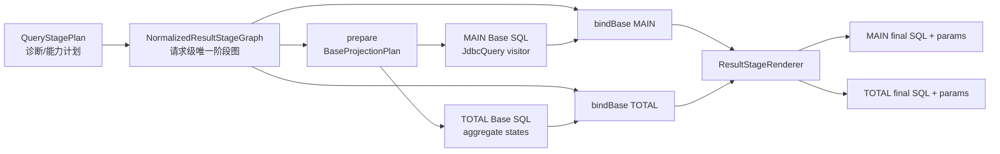

# `totalData` 共享结果阶段 Renderer 设计（方案 A：请求级准备 + 单一 Renderer）

## 1. 决策

本文记录最终采用的方案 A。早期“仅抽取共享 renderer”的候选方案 B 没有保证 MAIN/TOTAL 在 visitor
之前共享同一请求级事实源，已在实现 review 中被否决；其 review 过程仅保留在第 17 节作为历史记录。

Foggy 为每个请求只构建一次 `NormalizedResultStageGraph`，MAIN 与 TOTAL 都引用这个同一实例。
graph 在 aggregate base visitor 之前确定阶段拓扑、隐藏依赖和列生命周期；base visitor 完成后，
MAIN/TOTAL 分别把自己的 base SQL 与最终投影绑定到 graph，再交给唯一的内部
`ResultStageRenderer`。window、postAggregate、postSlice、CTE/derived table 包装、最终排序和参数
收集只能由该 renderer 完成；`JdbcModelQueryEngine` 不再分别维护 MAIN/TOTAL 两套手工拼装。

这不是查询引擎重写。事实表、JOIN、WHERE、GROUP BY、HAVING 和 aggregate state 的 base SQL
仍由现有 `JdbcQuery` visitor 及 `TotalDataAggregatePlan` 生成。共享协议分为 `prepare` 与
`bindBase/render` 两段：前者只决定 visitor 所需投影，后者从已完成的 base stage 生成可执行结果
阶段 SQL。renderer 本身从不修改 `JdbcQuery`，也不解析已经生成的 SQL 来补猜依赖。

实施基线是提交 `267dd887`。该基线已经修正 AVG 二次平均并通过 104 项定向测试；本 ADR 只消除
结果阶段 renderer 漂移风险，不重新设计 AVG state lowering。

## 2. 动机与当前问题

基线中存在三个相互独立的结果阶段 SQL 路径：

1. `generateWithCteWrapping` 生成普通 window MAIN 查询；
2. `generateWithPostAggregateWrapping` 生成 postAggregate MAIN 查询；
3. `renderAlgebraicTotalData` 为 TOTAL 再次手工生成 window、postAggregate 和 postSlice。

三条路径分别维护投影、隐藏依赖、stage alias、过滤、参数和 CTE/derived table 规则。实现审查已
证明这种复制会漂移：TOTAL 曾遗漏 window 未公开输入；进一步排查发现 MAIN 在分组包装后也会
丢失原始 `CalculatedDbColumn` 依赖。基线使用请求内“包装列 → 原始列”映射补齐了功能，但没有
消除下一次漂移的结构性原因。

## 3. 范围

### 3.1 本次包含

- MAIN/TOTAL 共用 window stage 渲染；
- MAIN/TOTAL 共用 postAggregate stage 渲染；
- MAIN/TOTAL 共用 postSlice/result-stage filter 渲染；
- 共用 CTE 与 derived table composer；
- 每个 SQL 单元独立持有参数，按最终 SQL 拓扑收集；
- 统一隐藏依赖、内部 aggregate state 和公开字段的投影角色；
- 保持 `QueryStagePlan` 诊断信息与实际可执行计划一致；
- 将安全除法收敛到内部方言适配边界，并增加多方言 SQL 契约测试。

### 3.2 本次不包含

- 不改变 `dataset.query_model` 请求或响应 DTO；
- 不修改公开 Model SPI、`DbColumn`/`CalculatedDbColumn` 契约；
- 共享 renderer 本身不负责创建预聚合 AVG 物化状态；该状态契约已由父 ADR 与
  [`AVG 预聚合状态迁移手册`](preagg-avg-state-migration-runbook.md) 独立实现和约束；
- 不新增 `COUNT_DISTINCT`、VAR、STDDEV 的可合并状态；
- 不解除 planner 当前拒绝的 window + postAggregate 混用；
- 不解除不支持 CTE 的 window derived renderer 限制；
- 不把 pagination 的 LIMIT/OFFSET 下推到 totalData；分页仍由上层执行器处理；
- 不借重构修改 groupBy、HAVING、postSlice 或 rank/share 的业务语义。

如果实施需要跨出 `foggy-dataset-model-engine`、修改公共 DTO/SPI、解除既有 planner 限制，或重写
aggregate base visitor，必须停止并重新评审。

## 4. 目标结构



`QueryStagePlan` 继续负责“是否需要某阶段、方言能力、诊断和 fail-closed”。请求级 factory 只能
从它构建一次 `NormalizedResultStageGraph`。新增的 `ExecutableResultStagePlan` 只是把 mode-specific
base/final projection 绑定到该 graph，不复制 render strategy、stage 顺序或 filter/order 拓扑。
`QueryStagePlan.Stage.parameterCount` 保持为兼容诊断值，不是执行参数的事实源。

## 5. 内部模型

建议新增在 `com.foggyframework.dataset.model.engine.stage`，所有类型保持 package-private 或 engine
internal，不进入 Model API：

```java
enum ResultRenderMode { MAIN, TOTAL }

enum StageColumnRole {
    PUBLIC_RESULT,
    HIDDEN_DEPENDENCY,
    INTERNAL_AGGREGATE_STATE,
    RESULT_STAGE_ONLY
}

record StageColumn(
    String alias,
    StageColumnRole role,
    String producerStageId,
    String lastConsumerStageId,
    DbColumnType type,
    String sourceLineage,
    BoundSqlExpression expression
) {}

record ResultStageSpec(
    String stageId,
    QueryStageType type,
    List<StageColumn> projections,
    List<ResultFilterSpec> filters,
    List<ResultOrderSpec> orders
) {}

record NormalizedResultStageGraph(
    QueryStagePlan diagnostics,
    List<ResultStageSpec> stages
) {}

record BaseProjectionPlan(
    List<StageColumn> mainColumns,
    List<StageColumn> totalColumns
) {}

record StructuredCteUnit(
    String alias,
    List<String> columnAliases,
    String body,
    List<Object> values
) {}

record RootSqlUnit(
    List<StructuredCteUnit> prerequisiteCtes,
    String boundThroughStageId,
    String baseBody,
    List<Object> baseValues,
    List<StageColumn> columns
) {}

record FinalProjectionSpec(
    String alias,
    StageColumnRole role,
    DbColumnType type,
    BoundSqlExpression expression
) {}

record ExecutableResultStagePlan(
    NormalizedResultStageGraph graph,
    ResultRenderMode mode,
    RootSqlUnit root,
    List<FinalProjectionSpec> finalProjection
) {}

record ResultStageRenderResult(
    String outerSql,
    String outerSqlWithoutOrder,
    List<Object> outerValues,
    List<SqlGenerationResult.CteStage> cteStages
) {
    // assembledSql()/assembledValues() 只按 cteStages -> outer 的顺序派生，不能另收参数。
}
```

名称可以在实现 review 后调整，但以下不变量不可改变：

- SQL 与参数必须在同一个不可变对象中传递；
- 每个投影必须有明确 alias 和 role；
- `NormalizedResultStageGraph` 在一次请求中只构建一次，MAIN/TOTAL 必须持有同一个实例；
- 每个 `ResultStageSpec.stageId/type` 必须与 `QueryStagePlan.Stage` 一对一，构造时校验无缺失、无新增、
  无重排；filter/order 必须归属于具体 stage，不能作为顶层游离列表；
- graph 同时镜像 ROW/AGG/结果/final 全部诊断 stage；`RootSqlUnit.boundThroughStageId` 标记现有 visitor
  已完成的最后一个 base stage，renderer 只能从其后继续，不能重新渲染 ROW/AGG；
- `QueryStagePlan.hasUnsupported()` 或既有 capability guard 失败，都是 `prepare/bindBase` 的硬门禁；
- renderer 不重新解析 SQL 文本推断依赖、参数或聚合类型；
- renderer 不修改 `JdbcQuery`、`DbQueryRequestDef` 或调用方集合；
- MAIN/TOTAL 使用同一个 graph、stage spec、stage-scoped alias registry 和 composer；
- `RootSqlUnit.baseBody` 禁止携带根级 `WITH`，domain transport 等 prerequisite CTE 只能以
  `StructuredCteUnit(alias, optional columns, body, values)` 结构化传入。
- `StructuredCteUnit` 必须先经方言 lowerer 把 optional columns 降低到合法 body，再输出根级 sibling
  `CteStage(alias, body, params)`；公开 alias 字段只能是纯 alias，禁止嵌入列清单。

## 6. 投影角色

### 6.1 `PUBLIC_RESULT`

用户 columns 中可见的维度、度量和计算字段。MAIN 最终只输出公开字段；TOTAL finalizer 对有
`TotalExpressionNode` 的字段执行状态 merge，对维度或不可 totalize 的公开字段继续输出 NULL，
保持提交 `267dd887` 的 `totalData` Map 键集合兼容。最终表达式使用 `FinalProjectionSpec`，其参数也
必须进入统一 collector。

### 6.2 `HIDDEN_DEPENDENCY`

window partition/order 或 postAggregate 输入需要、但用户没有公开选择的字段。它必须按原字段聚合
元数据进入 base stage，并由 `producerStageId/lastConsumerStageId` 约束贯穿到最后一个消费它的
stage；之后必须移除，不得进入 MAIN/TOTAL 最终投影。source lineage 必须指回原始列，不得只保存
临时包装列身份。

### 6.3 `INTERNAL_AGGREGATE_STATE`

AVG 的 `__foggy_avg_sum_*`、`__foggy_avg_count_*` 以及其他可合并 state。它只在 TOTAL 模式存在，
必须透传所有可能改变幸存分组集合的结果阶段，最终由 `TotalDataAggregatePlan` merge；不得出现在
响应或 MAIN SQL。

### 6.4 `RESULT_STAGE_ONLY`

rank、share、running value 等 window/postAggregate 输出。它们可以被 postSlice 和 orderBy 消费。
为保持基线兼容，若用户公开选择了这类字段，TOTAL 仍输出同名 NULL；该 NULL 只能由 total
finalizer 生成，不能作为中间阶段输入。本条是对父 ADR 7.3 的兼容性覆盖，并必须由 key-set 回归
测试固定。

## 7. 单一阶段流水线

renderer 只接受以下规范化顺序：

```text
base aggregate
  -> window（若有）
  -> postAggregate（若有）
  -> result filter / postSlice（若有）
  -> final projection
  -> final order（仅 MAIN）
```

当前 planner 不允许的 stage 组合仍在 renderer 前拒绝。renderer 不自行交换 stage、合并过滤或
猜测可执行性。上述流水线表示顺序上限，不表示 window 与 postAggregate 可以同时存在。

### 7.1 能力矩阵与硬门禁

| 组合 | CTE | derived | MAIN/TOTAL 契约 |
| --- | --- | --- | --- |
| window | 支持 | 拒绝 | 同一 graph，同一错误码 |
| postAggregate | 支持 | 仅无 domain CTE 时支持 | 同一 graph，同一错误码 |
| window + postAggregate | 拒绝 | 拒绝 | `post-aggregate-window-mix-unsupported` |
| 无 window/postAggregate 的裸 postSlice | 拒绝 | 拒绝 | `post-slice-result-stage-required` |
| derived + domain CTE | 不适用 | 拒绝 | 保持现有 fail-closed |

`QueryStagePlan.hasUnsupported()` 时不得创建 graph 或 executable plan。另设 engine-internal
`ResultStageCapabilityGuard`，只补充必须结合运行上下文判断的 `derived + domain CTE`，并复用现有
异常/错误标识；它不能修改 diagnostics schema 或另建 stage 拓扑。不得把 renderer contract 测试写成
上述能力的笛卡尔积并意外解锁组合。

### 7.2 MAIN

- base 包含公开 base 字段和隐藏依赖，不包含 aggregate states；
- 结果阶段输出用户公开字段；
- result filter 与 orderBy 使用统一 alias registry；
- `sqlWithoutOrder` 与 `sql` 由同一次 render 返回；
- LIMIT/OFFSET 不在 renderer 内生成。

### 7.3 TOTAL

- base 包含结果阶段所需公开输入、隐藏依赖和内部 aggregate states；
- 使用与 MAIN 相同的 window/postAggregate/result filter specs；
- 不渲染最终 orderBy，不接收分页参数；
- finalizer 对幸存行 merge states，并增加 `COUNT(*) AS total`；
- TOTAL 参数列表独立构建，不能复用 MAIN `values`。

## 8. CTE 与 derived table composer

`ResultStageRenderer` 内部只保留一个 composer 入口，具体策略直接由 graph 引用的
`QueryStagePlan.renderStrategy` 决定，executable plan 不得复制该字段：

- `cte`：每个需要 SQL boundary 的 stage 形成具名 `CteStage`；
- `derived`：同一 stage spec 以内嵌派生表表达；
- `single`：无结果阶段时直接返回 base；
- unsupported：在进入 renderer 前 fail closed。

CTE 名称保持基线稳定（例如 `stage1`、`post_stage`、`__POST_RESULT_STAGE__`）或通过一个
`StageAliasRegistry` 统一产生。内部 aggregate state 的 `__foggy_` 保留命名空间继续执行冲突检查。

禁止 MAIN composer 与 TOTAL composer 各自实现一套 `SELECT ... FROM (...)` 循环。

domain transport CTE 作为 `RootSqlUnit.prerequisiteCtes` 传入；renderer 在 CTE 策略下把它降低为
根级 sibling `CteStage`，并排在自身结果 stages 之前，禁止嵌入其他 stage body。derived + domain
CTE 保持拒绝。renderer 内部输出遵循 outer/assembled 双视图，但只保存一个不可变
`ResultStagePlan.RenderResult` 作为事实源：

- `JdbcModelQueryEngine.sql/values/innerSql/innerSqlWithoutOrder`：assembled SQL/参数，供 MAIN 分页
  直接执行；
- `ResultStagePlan.RenderResult`：唯一保存 outer SQL/参数与结构化 `cteStages`；不暴露公共 bean
  getter/setter；
- `JdbcModelQueryEngine.toSqlGenerationResult(...)`：从同一个 render result 生成 Compose/semantic 使用的
  outer SQL/参数与 `cteStages`；
- `getCteStage1*`、`getCteOuterSelect*`：仅保留为 deprecated 只读派生视图，不再对应独立字段，也没有
  setter；
- `aggSql/aggValues`：assembled SQL/参数；
- single/derived：outer 与 assembled 相同。

现有 `SqlGenerationResult.CteStage` 不表达 CTE column list，且本次禁止修改其公开语义。内部
`RootCteLowerer` 必须按方言把 column aliases 降低进 body，并产出普通根级
`CteStage(alias, loweredBody, params)`：

- PostgreSQL：列清单放入 body 内的 `VALUES` 派生表 alias；
- SQLite：在 body 的首层 SELECT 把 `column1..N` 显式 alias 为目标列；
- MySQL 8.0.19+：列清单放入 body 内 `VALUES ROW` 派生表 alias，保留现有版本门禁；
- SQL Server：沿用首个 `SELECT expression AS column`、后续 `UNION ALL` 的 body 形态。

上述 CTE 与结果 stage 都作为根级 siblings 交给现有 `SqlGenerationResult`；禁止 nested `WITH`，也
不得把 `alias(columns)` 塞入公开 alias 字段。某方言无法合法 lower 时 capability guard 必须
fail-closed 并触发停止条件。`JdbcModelQueryEngine` 的 assembled SQL 必须等于同一 render result 的
`SqlGenerationResult.getAssembledSql()`，参数只从同一结果派生，禁止二次追加。

## 9. 参数拓扑

`RootSqlUnit` 和每个 expression/filter/final projection 都持有不可变参数列表。renderer 必须按最终
SQL 结构递归组装 SQL unit，并在追加每段 SQL 文本时同步追加该段参数；唯一顺序规则是严格等于
最终 SQL 中占位符的词法顺序，不能用固定的业务阶段列表替代。

CTE 形态通常是：root sibling CTE 声明顺序（domain → base → window/postAggregate/result filter）后接
outer SELECT；每个 unit 内部再按 SELECT expression → FROM 子树 → WHERE/HAVING/ORDER 的实际 SQL
顺序收集。derived 形态的 outer SELECT expression 在内嵌 FROM 子树之前出现，因此其参数也必须在
子查询参数之前。若 final projection 与 result filter 位于同一个 SELECT，则 final expression 参数在
filter 参数之前；若 filter 被物化为前置 CTE，则 filter 参数先于 outer final expression。

实际实现允许 base visitor 将 SELECT/WHERE/HAVING 作为一个已绑定 `RootSqlUnit` 返回；renderer
不得拆开或重排该原子单元。AVG argument 同时渲染到 SUM/COUNT 时，各复制一份参数并放在各自 SQL
片段的词法位置。任何 SQL 单元的
占位符数量与 values 数量不一致都进入 `REFUSED`，不能借用 MAIN 参数补齐。

参数存在两个明确视图：`outerValues` 只对应 outer SQL；`assembledValues` 严格等于所有 root
sibling `CteStage.params` 按最终序列化出现顺序串联后再追加 `outerValues`。两种视图都由同一
render result 派生，不得维护第二个 collector。

## 10. 方言边界

- identifier quoting、NULL order、函数调用继续使用 `FDialect`；
- CTE/derived 能力继续由 `QueryStagePlan` 判定；
- total safe divide 固定使用内部类型化契约
  `renderRatio(FDialect, numerator, denominator, DbColumnType resultType)`，不在 finalizer 中硬编码；
- SQLite、MySQL、PostgreSQL、SQL Server 都必须生成 `NULLIF(denominator, 0)`，并按方言执行
  Decimal widening/整数除法提升；至少建立四方言 SQL 契约测试，SQLite 另做执行级验证；
- 本次不要求连接四种真实数据库，但 SQLite 必须执行级验证，其余为方言生成契约。

如果现有 `FDialect` 无法表达 safe divide，可以保留 engine 内部适配器；不得为本次重构修改公开
方言 SPI。

## 11. 与现有组件的责任边界

### `JdbcModelQueryEngine`

保留请求解析、`JdbcQuery` 构造、base visitor 调用、aggregate state plan 和最终字段赋值；删除三套
结果阶段字符串拼装，改为构造 executable plan 并调用 renderer。

### `QueryStagePlanner` / `QueryStagePlan`

继续负责能力与诊断，不直接持有 SQL。现有 `toDiagnosticsMap()` 字段、stage id、filterAliases、
orderAliases 和 parameterCount 必须保持兼容。

### `TotalDataAggregatePlan`

继续负责 aggregate leaf → state、merge/finalize 与不可合并聚合 fail-closed；不负责 window、
postAggregate、postSlice 或 CTE SQL。

### `ResultStagePlanFactory`

每个请求只调用一次 `prepare()`：把选中列、隐藏依赖、postAggregate 定义、result filter 和 order
转换为 `NormalizedResultStageGraph + BaseProjectionPlan`。隐藏依赖的“包装列 → 原始列”解包也在
这里统一，不在 MAIN/TOTAL 分支复制。MAIN/TOTAL 后续只能调用 `bindBase(mode, graph, root,
finalProjection)`；不得再次从 request 推导 stage/filter/order。

### `ResultStageRenderer`

纯 SQL renderer。输入相同的 stage specs 必须产生相同 stage topology；mode 只影响列角色、final
projection、final order 和 aggregate states，不影响过滤语义。

### Domain transport producer

CTE placement 的 `DomainRelationRenderer` 必须从生成源直接返回结构化
`alias + optional columnAliases + body + params`；`DomainTransportSqlInjection` 只做无损转换为
`StructuredCteUnit`。`sqlFragment` 仅为 derived placement 保留，禁止从完整
`name(columns) AS (...)` 字符串反向解析 alias/body。该调整限定在
`foggy-dataset-model-engine` 内；若必须改变跨模块 `SqlGenerationResult.CteStage` 的公开语义，立即
触发停止条件。

`RootCteLowerer` 是唯一的 column-list lowering 入口，输出普通根级 sibling
`SqlGenerationResult.CteStage`。它只消费结构化输入和 `FDialect`，不解析 SQL，不推断 stage 拓扑。

## 12. 迁移顺序（tests-first）

1. 以 `267dd887` 和 104 项定向测试为基线，新增 renderer contract 测试，先固定 graph identity、
   stage parity、normalized SQL、alias、参数和执行结果；
2. **门 1（可独立回退）**：新增内部 graph、plan、column role、root SQL/result 类型及 contract tests，
   不接入生产路径；
3. 抽取 stage-scoped alias registry、result filter builder 和唯一参数 collector，保持旧调用方；
4. **门 2（可独立回退）**：仅让 window MAIN 走共享 renderer，旧 CTE 测试与执行结果必须不变；
5. **门 3（可独立回退）**：仅让 postAggregate MAIN 的 CTE/derived 路径走同一 renderer；
6. **门 4（可独立回退）**：让 algebraic TOTAL 绑定同一 graph/renderer，只保留独立 finalizer；
7. 四个门全部 parity 通过后，才删除 `JdbcModelQueryEngine` 中旧的 window/postAggregate/postSlice
   SQL 拼装；
8. 运行定向回归并进行独立实现 review；通过后才开始最多 3 次全量测试。

每一步只允许一个行为变量。结构迁移不得与新聚合能力或请求语义变更混在同一提交。任一门 parity
未通过就回退该门；若必须同时切换两个门才能通过，触发停止条件并重新沟通。

## 13. 测试门槛

### 13.1 新增单元测试

- `ResultStageRendererTest`：仅覆盖能力矩阵允许的 MAIN/TOTAL、single/CTE/derived 与阶段组合；
- MAIN/TOTAL 引用同一 graph 实例和同一 stage IDs；executable specs 与 `QueryStagePlan` 一一对应；
- 投影角色：公开字段、隐藏依赖、内部 state、结果阶段字段；
- 每种角色的 producer/last-consumer 可见性与 source lineage；
- alias 冲突与 `__foggy_` 保留空间；
- 参数拓扑：domain/base/window/postAggregate/postSlice/final，以及 outer/assembled 两种视图；
- 参数化 final expression + postSlice 在 CTE/derived 两种形态下都与最终 SQL 占位符词法顺序一致；
- domain CTE 由 producer 结构化生成、无 SQL 反解析；方言 lower 后作为首批根级 sibling
  `CteStage`，SQL/参数顺序不变；
- PostgreSQL、SQLite、MySQL 8、SQL Server 的 `domain CTE + window/postAggregate` SQL 形状测试：
  不含 nested `WITH`，direct assembled 与 `SqlGenerationResult.getAssembledSql()` 完全同源；
- `sql` 与 `sqlWithoutOrder` 同源；
- TOTAL 无 order/limit/start；
- safe divide 多方言 SQL 契约。
- window derived、裸 postSlice、window + postAggregate、derived + domain CTE 的原错误码负向断言；
- CTE alias `stage1`、`post_stage`、`__POST_RESULT_STAGE__` 的基线兼容断言；
- TOTAL result-stage-only 字段保留同名 NULL key 的 key-set 断言。

### 13.2 保留集成测试

- `AverageTotalDataRegressionTest` 全部场景；
- `JdbcModelQueryEngineCteWrapTest` 全部场景；
- `AggSqlOptimizerTest`；
- `CalculatedFieldService*Test`；
- `PreAggregationAverageGuardTest`；
- `TotalDataAggregatePlanTest`。

必须额外保留样本量不均衡、NULL argument、WHERE/HAVING、多维分组、无 groupBy、分页、隐藏 window
输入、postAggregate + postSlice、window + postSlice 和不可合并聚合 fail-closed。

### 13.3 parity 断言

- MAIN 分组行值和顺序不变；
- TOTAL AVG 等于事实总体 AVG 或 postSlice 幸存组加权 AVG；
- SUM/COUNT/MIN/MAX 不变；
- QueryStagePlan diagnostics 不变；
- 参数数量、顺序和 SQL 占位符一致；
- pre-aggregation 的 skip/fallback 决策不变。

## 14. 停止条件

出现任一情况必须停止并重新沟通：

- 需要修改 engine 以外 Maven 模块；
- 需要改变公开请求、响应、Model SPI 或 `QueryStagePlan` diagnostics schema；
- 需要改变跨模块 `SqlGenerationResult.CteStage` 的 alias/body/params 公开语义；
- 需要解除当前 unsupported stage 组合；
- 不能在不解析已生成 SQL 文本的前提下表达 stage 依赖；
- 任一已支持 domain CTE 方言不能把 column aliases 合法 lowering 到 body 且保持纯 alias
  `CteStage`；
- MAIN/TOTAL parity 需要改变现有业务语义才能通过；
- 重构无法按 window、postAggregate、TOTAL 三个可独立验证阶段拆分；
- 同一个请求无法让 MAIN/TOTAL 引用同一个 normalized graph，或必须维护第二套执行拓扑/参数 collector；
- 任一迁移门必须与另一个门同时切换才能保持 parity；
- 定向测试出现无法归因于单一步骤的广泛失败。

## 15. 成本与影响

预期只影响 `foggy-dataset-model-engine`：新增约 6—8 个内部 plan/renderer/lowerer 类型，并小幅调整
4 个现有 domain CTE renderer 的结构化返回，显著删除 `JdbcModelQueryEngine` 中重复 SQL 拼装。风险
主要集中在多阶段 SQL alias、参数顺序、domain/root CTE、多方言 derived 分支和 diagnostics parity，
整体仍为中等风险；业务 API、模型定义和普通单阶段查询应保持无感。若 domain 调整无法保持为
“同模块内结构化返回 + SQL 形状 parity”，即视为复杂度扩散并停止。

最终方案 A 的收益是后续新增 aggregate state、结果阶段过滤或方言策略时只修改一个请求级准备计划和
一个 renderer，不再要求
MAIN/TOTAL 手工同步。

## 16. 验收标准

- 代码中只有一个结果阶段 renderer 负责 window/postAggregate/postSlice 与 CTE/derived 组装；
- `JdbcModelQueryEngine` 的三个旧手工路径改为 plan + renderer 调用，重复循环被删除；
- MAIN/TOTAL 使用相同 stage specs 和 alias registry；
- TOTAL 参数完全独立且拓扑正确；
- `267dd887` 的 104 项定向基线和新增 renderer 测试全部通过；
- 独立设计 review 与实现 review 都为 GO；
- 最多 3 次全量测试内完成，次数耗尽则停止报告。

## 17. Review 记录

2026-08-29：早期候选方案 B 初稿首轮独立 review 为 NO-GO；无 P0，7 类 P1 已修订。

2026-08-29：第二轮独立 review 为 NO-GO；6 类已关闭，剩余 assembled/outer 字段映射和 domain CTE
结构化生产端契约已修订，等待最终门禁 review。未通过前不得修改生产 renderer。

2026-08-29：第三轮独立 review 为 NO-GO；assembled/outer 已关闭，domain CTE 的 nested `WITH`
适配被拒绝。现改为方言 lower body + 根级 sibling `CteStage`，等待最终门禁 review。

2026-08-29：第四轮独立 review 为 GO；无 P0/P1。批准按四个可回退迁移门进入 tests-first 开发。

2026-08-29：tests-first 建模时发现固定业务阶段参数顺序不适用于 derived/同层 SELECT；已改为按最终
SQL unit 结构和占位符词法顺序收集，等待独立快速复核。

2026-08-29：参数拓扑快速独立复核为 GO；无 P0/P1，设计继续保持 accepted。

2026-08-29：首轮实现独立 review 为 NO-GO；发现 graph/base projection 尚未在 visitor 前形成唯一事实源，
以及缺少 `domain CTE + AVG state params + visitor params + result stage + postSlice/final` 组合拓扑测试。
经授权按严格方案 A 收口：新增请求级 `ResultStagePreparation`，在任一 SQL visitor 前一次构造 graph 与
MAIN/TOTAL `BaseProjectionPlan`，TOTAL 不再重新推导 window 隐藏依赖；renderer 改为按列生命周期显式投影。

2026-08-29：严格方案 A 最终独立实现 review 为 GO；无 P0/P1，可以进入全量测试门禁。复审确认：
MAIN/TOTAL 引用同一 graph，AVG 仍以 `SUM(group_sum) / SUM(group_count)` finalize，TOTAL 排除最终排序与分页，
四方言参数拓扑和 SQLite 组合执行测试已覆盖。非阻断残余风险为数值 aggregate leaf 当前统一按
`DbColumnType.NUMBER` 绑定；现有支持方言 widening 语义一致，待未来引入 MONEY/自定义数值类型时再细化。

2026-08-29：本轮加固最终独立 review 为 GO；无 P0/P1。复审确认 domain CTE 先于 `stage1` 时，
废弃兼容 getter 仍按 alias 精确返回 `stage1` 的 SQL/params；新增 SQLite 生命周期测试实际执行生产
Builder 生成的 DDL、FULL/INCREMENTAL refresh SQL 和生产 Rewriter 生成的 AVG state rollup SQL，
不均衡样本、NULL 与事实 AVG parity 均有可失败断言。唯一 P2 为 `PreAggQueryRewriter` 仍有约 2318 行，
本轮不做高风险拆分；仅在新增 VAR/STDDEV 等代数状态或再次大改预聚合重写时启动专项拆分。

## 18. 验证与全量测试记录

### 18.1 既有基线验证（方案 A 首次交付）

2026-08-29：tests-first 与迁移门定向测试完成。renderer/AVG 场景矩阵 159/159 通过；内部 API 暴露
约束补测后相关类 48/48 通过；首轮全量问题修正后的 AVG、COUNT_DISTINCT、analytics、pivot、Odoo
组合回归 55/55 通过。`HistoricalFullTruckWaybillQuery` 对应的不均衡年度样本验证 TOTAL AVG 为
`SUM(group_sum) / SUM(group_count)`，即约 `8888.45308896`，而不是分组 AVG 的简单平均。

全量测试严格使用 `mvn -o -B -ntp test -DskipITs`，授权额度及结果如下：

1. 第 1/3 次在 engine 模块发现 6 个既有 COUNT_DISTINCT 主查询被 total fail-closed 提前拒绝；拒绝条件
   收窄为仅 `returnTotal=true` 后，相关定向回归 55/55 通过；
2. 第 2/3 次 engine 3276 项通过，后在 `foggy-runtime-api` 的
   `RuntimeApiAuthCodeGateTest` 出现 17 个 ApplicationContext 错误。根因是既有
   `RuntimeMembersController` 新增 `JdbcService` 构造依赖后，该集成测试未同步提供 mock；仅补充
   `@MockitoBean JdbcService`，不修改生产代码，定向验证 17/17 通过；
3. 第 3/3 次 44/44 reactor 模块全部通过，BUILD SUCCESS，总耗时 15:47；engine 3276 项为
   0 failures / 0 errors / 2 skipped，runtime-api 与两个前端 console 的 typecheck、unit test、build 均通过。

该轮基线结论：验收门全部关闭；SUM、COUNT、MIN、MAX、无 groupBy、过滤、分页、多层分组、window、
postAggregate/postSlice 及不可合并聚合 fail-closed 回归通过。全量额度已用完，不再追加全量运行。

### 18.2 本轮加固验证（预聚合状态、测试拆分与 CTE 单一表示）

本轮在上述基线之后增加以下提交：

- `562e469e`：AVG 预聚合物化为 `SUM/COUNT` 双状态；
- `3fa091fe`：增加 `HistoricalFullTruckWaybillQuery` 直接回归并拆分大型测试；
- `7944cfe3`：`ResultStagePlan.RenderResult` 成为 CTE outer/assembled 的唯一事实源。

当前定向结果：AVG/结果阶段联合回归 50/50，通过；CTE/Compose/renderer 组合回归 45/45，通过；
CTE 核心最终回归 14/14，通过；最终 review 修复后的 engine 组合回归 37/37、预聚合 SQL Builder 与
SQLite AVG 生命周期回归 31/31，通过。新的 reactor 全量测试额度为 3 次，目前使用 0/3；最终独立
review 已 GO，下一步开始使用该额度，结果将在本节继续追加，不复用 18.1 的历史结论。

2026-08-29：本轮第 1/3 次执行 `mvn -o -B -ntp test -DskipITs` 即通过，44/44 reactor 模块全部
SUCCESS，BUILD SUCCESS，总耗时 29:08。engine 3284 项为 0 failures / 0 errors / 2 skipped；
预聚合模块 48/48 通过（包含 AVG 状态 SQLite 生命周期测试）；runtime-api 271 项为
0 failures / 0 errors / 7 skipped；analytics console 与 runtime console 的 typecheck、unit test、
production build 均通过。因首轮已完成门禁，不再重复运行；本轮全量额度最终使用 1/3，余 2 次未使用。
