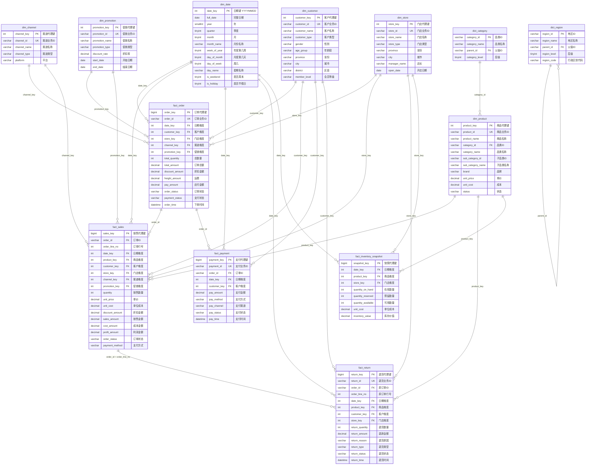
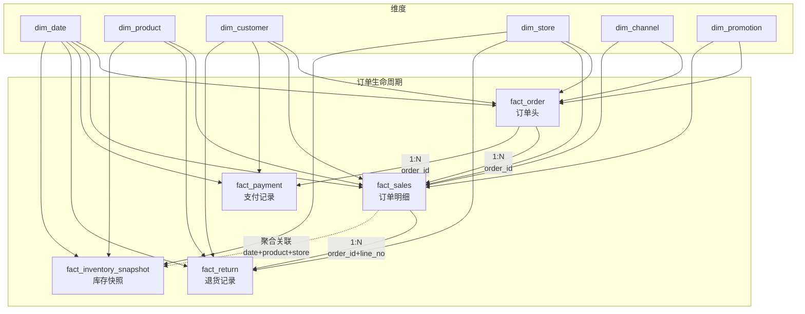
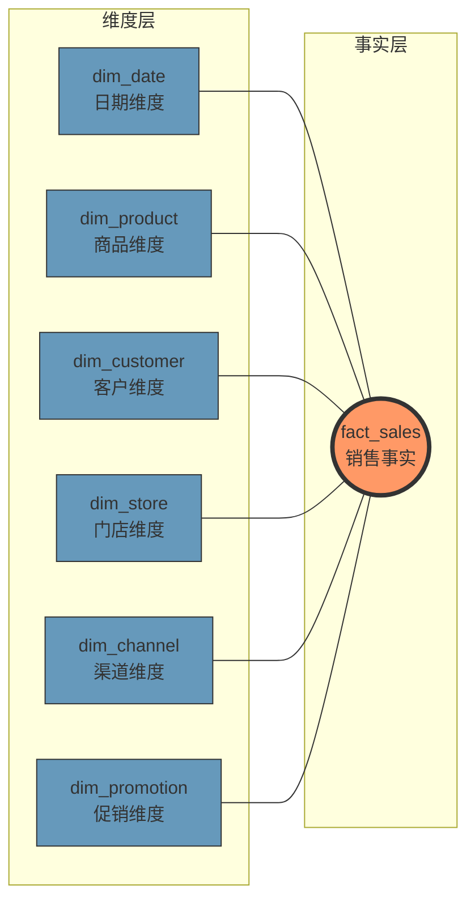
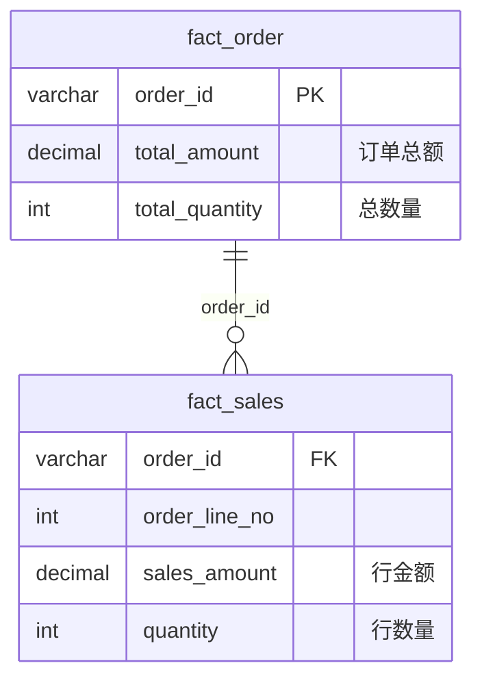
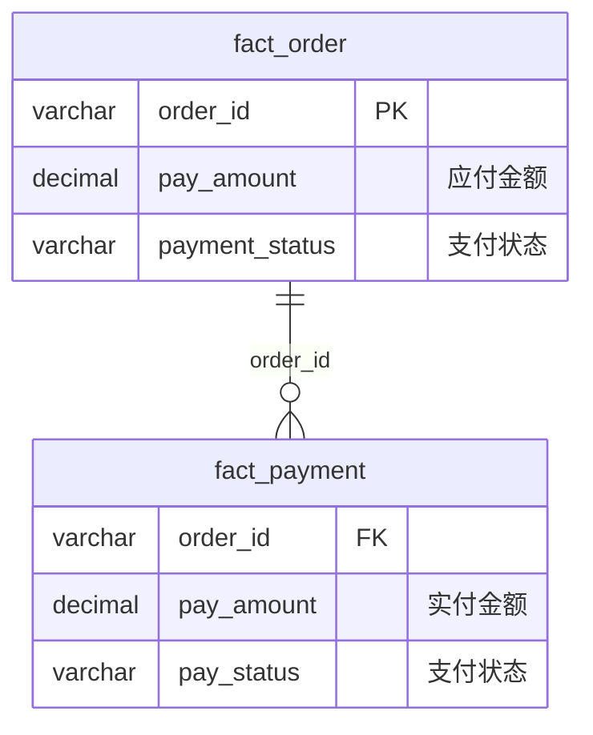
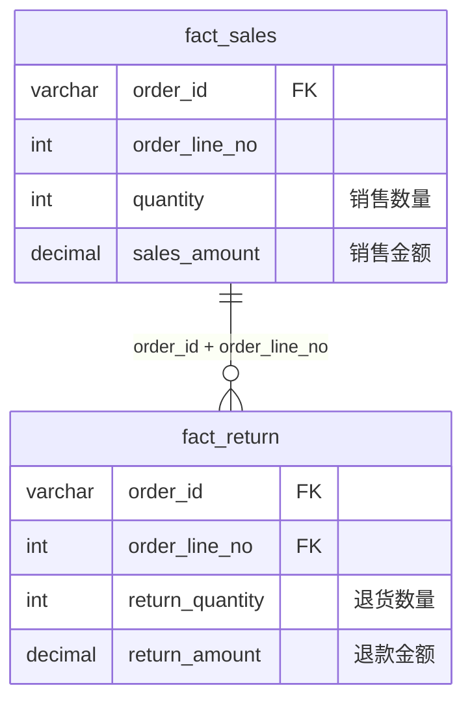
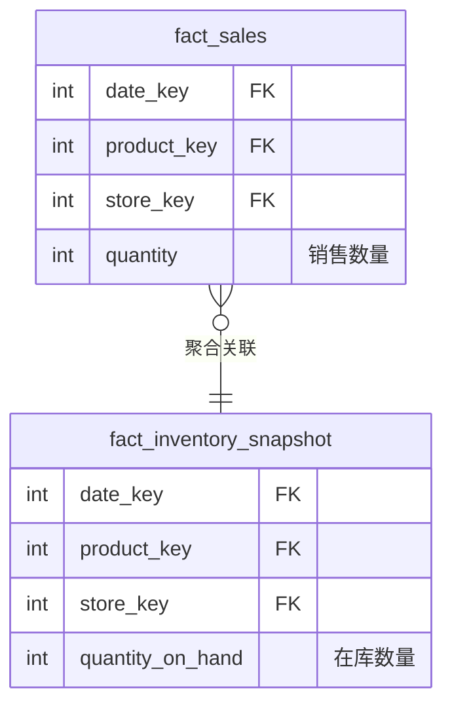

# Foggy Dataset Model 测试数据模型设计

> 基于电商销售分析场景的星型模型设计，用于单元测试和集成测试

## 1. 模型概述

### 1.1 设计原则

- **业界标准**：采用 Kimball 维度建模方法论
- **星型模型**：事实表为中心，维度表环绕
- **完整业务链路**：覆盖订单全生命周期
- **多种 JOIN 场景**：支持主从、同粒度、跨粒度关联测试

### 1.2 业务场景

```
电商销售分析场景：
┌─────────────────────────────────────────────────────────────────┐
│  客户下单 → 支付 → 发货 → 收货 → (可能退货)                       │
│     ↓        ↓                       ↓                          │
│  fact_order → fact_payment      fact_return                     │
│     ↓                                                           │
│  fact_sales (订单明细)                                           │
│     ↓                                                           │
│  fact_inventory_snapshot (库存影响)                              │
└─────────────────────────────────────────────────────────────────┘
```

---

## 2. 数据模型 ER 图

### 2.1 完整模型关系图



### 2.2 事实表关联关系图



### 2.3 星型模型视图



---

## 3. JOIN 测试场景

### 3.1 场景矩阵

| 场景编号 | 场景名称 | 关联表 | 关联类型 | 关联键 |
|----------|----------|--------|----------|--------|
| J01 | 主从关联 | fact_order ↔ fact_sales | 1:N | order_id |
| J02 | 业务流程关联 | fact_order ↔ fact_payment | 1:N | order_id |
| J03 | 正逆向关联 | fact_sales ↔ fact_return | 1:N | order_id + order_line_no |
| J04 | 跨粒度关联 | fact_sales ↔ fact_inventory_snapshot | N:1 (聚合) | date_key + product_key + store_key |
| J05 | 多事实表关联 | fact_order ↔ fact_sales ↔ fact_payment | 链式 | order_id |
| J06 | 维度关联 | fact_sales ↔ dim_* | N:1 | *_key |
| J07 | 层级维度 | dim_product ↔ dict_category | N:1 (多级) | category_id |
| J08 | 地区层级 | dim_customer ↔ dict_region | 多级 | province/city/district |

### 3.2 场景详细说明

#### J01: 订单头与订单明细（主从关联）



**测试用例**：
```sql
-- 查询订单及其明细
SELECT
    o.order_id,
    o.total_amount,
    s.product_key,
    s.sales_amount
FROM fact_order o
LEFT JOIN fact_sales s ON o.order_id = s.order_id
WHERE o.date_key = 20240101
```

#### J02: 订单与支付（业务流程关联）



**测试用例**：
```sql
-- 订单支付分析
SELECT
    o.order_id,
    o.pay_amount AS should_pay,
    SUM(p.pay_amount) AS actual_pay,
    COUNT(p.payment_id) AS pay_times
FROM fact_order o
LEFT JOIN fact_payment p ON o.order_id = p.order_id
GROUP BY o.order_id, o.pay_amount
```

#### J03: 销售与退货（正逆向关联）



**测试用例**：
```sql
-- 净销售额计算
SELECT
    s.product_key,
    SUM(s.sales_amount) AS gross_sales,
    COALESCE(SUM(r.return_amount), 0) AS returns,
    SUM(s.sales_amount) - COALESCE(SUM(r.return_amount), 0) AS net_sales
FROM fact_sales s
LEFT JOIN fact_return r
    ON s.order_id = r.order_id
    AND s.order_line_no = r.order_line_no
GROUP BY s.product_key
```

#### J04: 销售与库存（跨粒度关联）



**测试用例**：
```sql
-- 销售与库存对比（需先聚合销售数据）
SELECT
    i.date_key,
    i.product_key,
    i.store_key,
    i.quantity_on_hand,
    COALESCE(s.daily_sales, 0) AS daily_sales,
    i.quantity_on_hand / NULLIF(s.daily_sales, 0) AS days_of_supply
FROM fact_inventory_snapshot i
LEFT JOIN (
    SELECT date_key, product_key, store_key, SUM(quantity) AS daily_sales
    FROM fact_sales
    GROUP BY date_key, product_key, store_key
) s ON i.date_key = s.date_key
    AND i.product_key = s.product_key
    AND i.store_key = s.store_key
```

---

## 4. 维度表详细设计

### 4.1 日期维度 (dim_date)

| 字段 | 类型 | 说明 | 示例 |
|------|------|------|------|
| date_key | INT | 主键 YYYYMMDD | 20240101 |
| full_date | DATE | 完整日期 | 2024-01-01 |
| year | SMALLINT | 年 | 2024 |
| quarter | TINYINT | 季度 | 1 |
| month | TINYINT | 月 | 1 |
| month_name | VARCHAR(20) | 月份名称 | 一月 |
| week_of_year | TINYINT | 年度第几周 | 1 |
| day_of_month | TINYINT | 月度第几天 | 1 |
| day_of_week | TINYINT | 周几 (1=周一) | 1 |
| day_name | VARCHAR(20) | 星期名称 | 星期一 |
| is_weekend | TINYINT | 是否周末 | 0 |
| is_holiday | TINYINT | 是否节假日 | 1 |
| fiscal_year | SMALLINT | 财年 | 2024 |
| fiscal_quarter | TINYINT | 财季 | 1 |

### 4.2 商品维度 (dim_product)

| 字段 | 类型 | 说明 | 示例 |
|------|------|------|------|
| product_key | INT | 代理键 | 1001 |
| product_id | VARCHAR(32) | 业务ID | PRD00001 |
| product_name | VARCHAR(200) | 商品名称 | iPhone 15 Pro |
| category_id | VARCHAR(32) | 一级品类ID | CAT001 |
| category_name | VARCHAR(100) | 一级品类名 | 数码电器 |
| sub_category_id | VARCHAR(32) | 二级品类ID | CAT001001 |
| sub_category_name | VARCHAR(100) | 二级品类名 | 手机 |
| brand | VARCHAR(100) | 品牌 | Apple |
| supplier_id | VARCHAR(32) | 供应商ID | SUP001 |
| unit_price | DECIMAL(18,2) | 售价 | 8999.00 |
| unit_cost | DECIMAL(18,2) | 成本 | 7200.00 |
| status | VARCHAR(20) | 状态 | ACTIVE |

### 4.3 客户维度 (dim_customer)

| 字段 | 类型 | 说明 | 示例 |
|------|------|------|------|
| customer_key | INT | 代理键 | 2001 |
| customer_id | VARCHAR(32) | 业务ID | CUS00001 |
| customer_name | VARCHAR(100) | 客户名称 | 张三 |
| customer_type | VARCHAR(20) | 客户类型 | VIP |
| gender | VARCHAR(10) | 性别 | 男 |
| age_group | VARCHAR(20) | 年龄段 | 25-34 |
| province | VARCHAR(50) | 省份 | 浙江省 |
| city | VARCHAR(50) | 城市 | 杭州市 |
| district | VARCHAR(50) | 区县 | 西湖区 |
| register_date | DATE | 注册日期 | 2023-01-15 |
| member_level | VARCHAR(20) | 会员等级 | 金卡 |
| status | VARCHAR(20) | 状态 | ACTIVE |

### 4.4 门店维度 (dim_store)

| 字段 | 类型 | 说明 | 示例 |
|------|------|------|------|
| store_key | INT | 代理键 | 3001 |
| store_id | VARCHAR(32) | 业务ID | STR00001 |
| store_name | VARCHAR(100) | 门店名称 | 杭州西湖银泰店 |
| store_type | VARCHAR(20) | 门店类型 | 直营 |
| province | VARCHAR(50) | 省份 | 浙江省 |
| city | VARCHAR(50) | 城市 | 杭州市 |
| district | VARCHAR(50) | 区县 | 西湖区 |
| address | VARCHAR(500) | 详细地址 | 延安路xxx号 |
| manager_name | VARCHAR(50) | 店长 | 李经理 |
| open_date | DATE | 开店日期 | 2020-06-01 |
| area_sqm | DECIMAL(10,2) | 面积(㎡) | 500.00 |
| status | VARCHAR(20) | 状态 | ACTIVE |

### 4.5 渠道维度 (dim_channel)

| 字段 | 类型 | 说明 | 示例 |
|------|------|------|------|
| channel_key | INT | 代理键 | 4001 |
| channel_id | VARCHAR(32) | 业务ID | CHN00001 |
| channel_name | VARCHAR(100) | 渠道名称 | 天猫旗舰店 |
| channel_type | VARCHAR(50) | 渠道类型 | ONLINE |
| platform | VARCHAR(50) | 平台 | 天猫 |
| status | VARCHAR(20) | 状态 | ACTIVE |

### 4.6 促销维度 (dim_promotion)

| 字段 | 类型 | 说明 | 示例 |
|------|------|------|------|
| promotion_key | INT | 代理键 | 5001 |
| promotion_id | VARCHAR(32) | 业务ID | PRM00001 |
| promotion_name | VARCHAR(200) | 促销名称 | 双11全场满300减50 |
| promotion_type | VARCHAR(50) | 促销类型 | 满减 |
| discount_rate | DECIMAL(5,2) | 折扣率 | 0.85 |
| start_date | DATE | 开始日期 | 2024-11-01 |
| end_date | DATE | 结束日期 | 2024-11-11 |
| status | VARCHAR(20) | 状态 | ACTIVE |

---

## 5. 事实表详细设计

### 5.1 订单事实表 (fact_order)

| 字段 | 类型 | 说明 | 聚合方式 |
|------|------|------|----------|
| order_key | BIGINT | 代理键 | - |
| order_id | VARCHAR(32) | 订单业务ID | COUNT DISTINCT |
| date_key | INT | 下单日期维度 | - |
| customer_key | INT | 客户维度 | - |
| store_key | INT | 门店维度 | - |
| channel_key | INT | 渠道维度 | - |
| promotion_key | INT | 促销维度 | - |
| total_quantity | INT | 订单总数量 | SUM |
| total_amount | DECIMAL(18,2) | 订单总额 | SUM |
| discount_amount | DECIMAL(18,2) | 折扣金额 | SUM |
| freight_amount | DECIMAL(18,2) | 运费 | SUM |
| pay_amount | DECIMAL(18,2) | 应付金额 | SUM |
| order_status | VARCHAR(20) | 订单状态 | - |
| payment_status | VARCHAR(20) | 支付状态 | - |
| order_time | DATETIME | 下单时间 | - |

**订单状态枚举**：
- `PENDING` - 待处理
- `PAID` - 已支付
- `SHIPPED` - 已发货
- `COMPLETED` - 已完成
- `CANCELLED` - 已取消

### 5.2 销售事实表 (fact_sales)

| 字段 | 类型 | 说明 | 聚合方式 |
|------|------|------|----------|
| sales_key | BIGINT | 代理键 | - |
| order_id | VARCHAR(32) | 订单ID | - |
| order_line_no | INT | 订单行号 | - |
| date_key | INT | 销售日期维度 | - |
| product_key | INT | 商品维度 | - |
| customer_key | INT | 客户维度 | - |
| store_key | INT | 门店维度 | - |
| channel_key | INT | 渠道维度 | - |
| promotion_key | INT | 促销维度 | - |
| quantity | INT | 销售数量 | SUM |
| unit_price | DECIMAL(18,2) | 单价 | AVG |
| unit_cost | DECIMAL(18,2) | 单位成本 | AVG |
| discount_amount | DECIMAL(18,2) | 折扣金额 | SUM |
| sales_amount | DECIMAL(18,2) | 销售金额 | SUM |
| cost_amount | DECIMAL(18,2) | 成本金额 | SUM |
| profit_amount | DECIMAL(18,2) | 利润金额 | SUM |
| tax_amount | DECIMAL(18,2) | 税额 | SUM |
| order_status | VARCHAR(20) | 订单状态 | - |
| payment_method | VARCHAR(50) | 支付方式 | - |

### 5.3 支付事实表 (fact_payment)

| 字段 | 类型 | 说明 | 聚合方式 |
|------|------|------|----------|
| payment_key | BIGINT | 代理键 | - |
| payment_id | VARCHAR(32) | 支付业务ID | COUNT DISTINCT |
| order_id | VARCHAR(32) | 订单ID | - |
| date_key | INT | 支付日期维度 | - |
| customer_key | INT | 客户维度 | - |
| pay_amount | DECIMAL(18,2) | 支付金额 | SUM |
| pay_method | VARCHAR(50) | 支付方式 | - |
| pay_channel | VARCHAR(50) | 支付渠道 | - |
| pay_status | VARCHAR(20) | 支付状态 | - |
| pay_time | DATETIME | 支付时间 | - |

**支付方式枚举**：
- `ALIPAY` - 支付宝
- `WECHAT` - 微信支付
- `CARD` - 银行卡
- `CASH` - 现金

**支付状态枚举**：
- `SUCCESS` - 成功
- `FAILED` - 失败
- `REFUNDING` - 退款中
- `REFUNDED` - 已退款

### 5.4 退货事实表 (fact_return)

| 字段 | 类型 | 说明 | 聚合方式 |
|------|------|------|----------|
| return_key | BIGINT | 代理键 | - |
| return_id | VARCHAR(32) | 退货业务ID | COUNT DISTINCT |
| order_id | VARCHAR(32) | 原订单ID | - |
| order_line_no | INT | 原订单行号 | - |
| date_key | INT | 退货日期维度 | - |
| product_key | INT | 商品维度 | - |
| customer_key | INT | 客户维度 | - |
| store_key | INT | 门店维度 | - |
| return_quantity | INT | 退货数量 | SUM |
| return_amount | DECIMAL(18,2) | 退款金额 | SUM |
| return_reason | VARCHAR(200) | 退货原因 | - |
| return_type | VARCHAR(20) | 退货类型 | - |
| return_status | VARCHAR(20) | 退货状态 | - |
| return_time | DATETIME | 退货时间 | - |

**退货类型枚举**：
- `REFUND_ONLY` - 仅退款
- `RETURN_REFUND` - 退货退款

**退货状态枚举**：
- `PENDING` - 待审核
- `APPROVED` - 已批准
- `COMPLETED` - 已完成
- `REJECTED` - 已拒绝

### 5.5 库存快照事实表 (fact_inventory_snapshot)

| 字段 | 类型 | 说明 | 聚合方式 |
|------|------|------|----------|
| snapshot_key | BIGINT | 代理键 | - |
| date_key | INT | 快照日期维度 | - |
| product_key | INT | 商品维度 | - |
| store_key | INT | 门店维度 | - |
| quantity_on_hand | INT | 在库数量 | SUM / LAST |
| quantity_reserved | INT | 预留数量 | SUM / LAST |
| quantity_available | INT | 可用数量 | SUM / LAST |
| unit_cost | DECIMAL(18,2) | 单位成本 | AVG |
| inventory_value | DECIMAL(18,2) | 库存价值 | SUM |

---

## 6. 字典表设计

### 6.1 地区字典 (dict_region)

```
中国
├── 浙江省 (level=1)
│   ├── 杭州市 (level=2)
│   │   ├── 西湖区 (level=3)
│   │   ├── 上城区 (level=3)
│   │   └── ...
│   ├── 宁波市 (level=2)
│   └── ...
├── 江苏省 (level=1)
│   └── ...
└── ...
```

### 6.2 品类字典 (dict_category)

```
全部品类
├── 数码电器 (level=1)
│   ├── 手机 (level=2)
│   │   ├── 智能手机 (level=3)
│   │   └── 功能机 (level=3)
│   ├── 电脑 (level=2)
│   │   ├── 笔记本 (level=3)
│   │   └── 台式机 (level=3)
│   └── ...
├── 服装配饰 (level=1)
│   └── ...
└── ...
```

---

## 7. 数据量规划

| 表名 | 数据量 | 说明 |
|------|--------|------|
| **维度表** | | |
| dim_date | 1,096 | 3年日期 (2022-2024) |
| dim_product | 500 | 500种商品 |
| dim_customer | 1,000 | 1000个客户 |
| dim_store | 50 | 50家门店 |
| dim_channel | 10 | 10个渠道 |
| dim_promotion | 30 | 30个促销活动 |
| **事实表** | | |
| fact_order | 20,000 | 2万订单 |
| fact_sales | 100,000 | 10万销售明细 (平均每订单5行) |
| fact_payment | 22,000 | 约10%订单有多次支付 |
| fact_return | 5,000 | 约5%退货率 |
| fact_inventory_snapshot | 25,000 | 500商品×50门店 |
| **字典表** | | |
| dict_region | ~3,500 | 省市区三级 |
| dict_category | 100 | 3级品类 |
| dict_status | 50 | 各类状态码 |

---

## 8. 附录

### 8.1 相关文档

- [多数据库测试指南](./MULTI_DATABASE_TESTING.md)

### 8.2 版本历史

| 版本 | 日期 | 作者 | 说明 |
|------|------|------|------|
| 1.0 | 2024-11-25 | Claude | 初始版本 |

---

> 本文档基于 Kimball 维度建模方法论设计，适用于 Foggy Dataset Model 的单元测试和集成测试场景。
